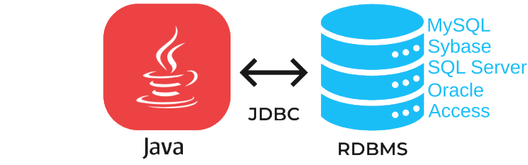
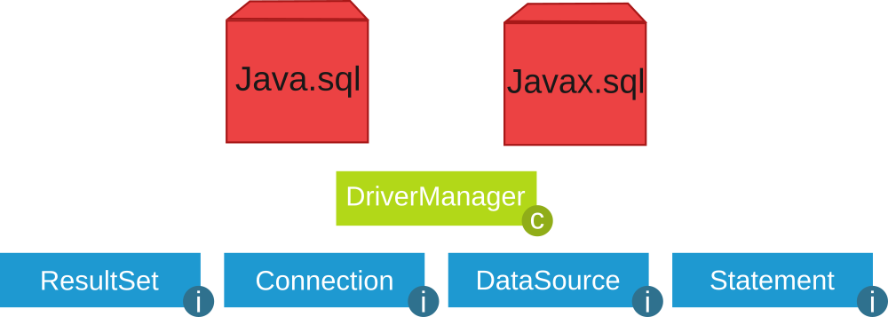
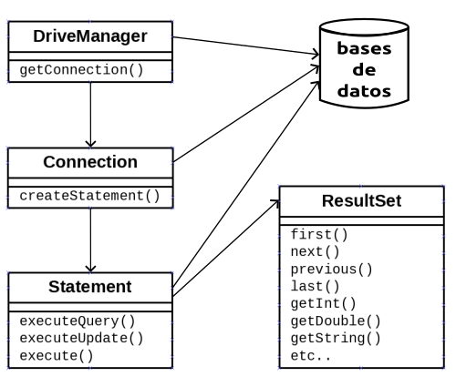
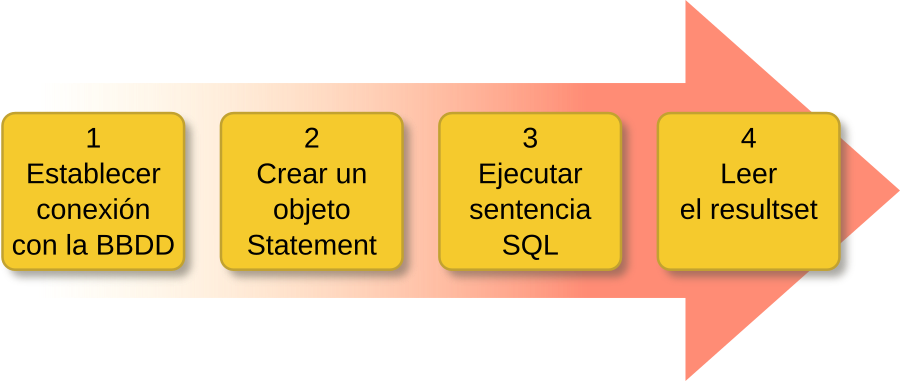

---
title: UD10: Acceso a Bases de Datos Relacionales
language: ES
author: David Martínez Peña [www.martinezpenya.es]
subject: Programación
keywords: [PRG, 2025, Programacion, Java]
IES: IES Eduardo Primo Marqués [www.ieseduardoprimo.es]
header: ${title} - ${subject} (ver. ${today}) 
footer:${currentFileName}.pdf - ${author} - ${IES} - ${pageNo}/${pageCount}
typora-root-url:${filename}/../
typora-copy-images-to:${filename}/../assets
---


[toc]

# Introducción

Hoy en día, la mayoría de aplicaciones informáticas necesitan almacenar y gestionar gran cantidad de datos. Esos datos, se suelen guardar en **bases de datos relacionales**, ya que éstas son las más extendidas actualmente.

Las bases de datos relacionales permiten organizar los datos en **tablas** y esas tablas y datos se relacionan mediante campos clave. Además se trabaja con el lenguaje estándar conocido como **SQL**, para poder realizar las consultas que deseemos a la base de datos.

Una base de datos relacional se puede definir de una manera simple como aquella que presenta la información en tablas con filas y columnas.

Una tabla es una serie de **filas** y **columnas** , en la que cada fila es un **registro** y cada columna es un **campo**. Un campo representa un dato de los elementos almacenados en la tabla (*NSS*, *nombre*, *etc*.). Cada registro representa un elemento de la tabla (el equipo Real Madrid, el equipo Real Murcia, etc.)

No se permite que pueda aparecer dos o más veces el mismo registro, por lo que uno o más campos de la tabla forman lo que se conoce como **clave primaria** (atributo que se elige como identificador en una tabla, de manera que no haya dos registros iguales, sino que se diferencien al menos en esa clave. Por ejemplo, en el caso de una tabla que guarda datos de personas, el número de la seguridad social, podría elegirse como clave primaria, pues sabemos que aunque haya dos personas llamadas, por ejemplo, Juan Pérez Pérez, estamos seguros de que su número de seguridad social será distinto).

El sistema gestor de bases de datos, en inglés conocido como: **Database Management System** (**DBMS**) , gestiona el modo en que los datos se almacenan, mantienen y recuperan.

En el caso de una base de datos relacional, el sistema gestor de base de datos se denomina: **Relational Database Management System** (**RDBMS**).

Tradicionalmente, la programación de bases de datos ha sido como una Torre de Babel: gran cantidad de productos de bases de datos en el mercado, y cada uno “hablando” en su lenguaje privado con las aplicaciones.

Java, mediante **JDBC** ( Java Database Connectivity, API que permite la ejecución de operaciones sobre bases de datos desde el lenguaje de programación Java, independientemente del sistema operativo donde se ejecute o de la base de datos a la cual se accede), permite simplificar el acceso a base de datos , proporcionando un lenguaje mediante el cual las aplicaciones pueden comunicarse con motores de bases de datos. Sun desarrolló este API para el acceso a bases de datos, con tres objetivos principales en mente:

- Ser un API con soporte de SQL: poder construir sentencias SQL e insertarlas dentro de llamadas al API de Java,
- Aprovechar la experiencia de los APIs de bases de datos existentes,
- Ser sencillo.

> ## **Qué es una API?**
>
> ​	**API**: *Application Programming Interface* (Interfaz de Programación de Aplicaciones). Conjunto de reglas y protocolos que permite a diferentes aplicaciones o sistemas comunicarse entre sí. En pocas palabras, actúa como un intermediario que permite que dos programas informáticos se comuniquen y compartan datos entre ellos de manera segura y eficiente. Las APIs se utilizan comúnmente en el desarrollo de software para permitir la integración de diferentes sistemas, la creación de aplicaciones de terceros y la automatización de procesos.
> ​	Un ejemplo sencillo de API podría ser el servicio de pronóstico del tiempo proporcionado por una compañía meteorológica. Imagina que tienes una aplicación de clima en tu teléfono. Esta aplicación necesita mostrar el pronóstico del tiempo actualizado, pero no tiene la capacidad de predecir el clima por sí misma.
> ​	En lugar de eso, la aplicación utiliza una API proporcionada por una empresa meteorológica. Esta API permite que la aplicación envíe una solicitud con la ubicación actual del usuario y, a cambio, recibe datos sobre el clima en esa ubicación. La API proporciona estos datos en un formato estructurado, como JSON o XML, que la aplicación puede interpretar y mostrar de manera comprensible para el usuario.
> ​	En resumen, la aplicación de clima utiliza la API de la empresa meteorológica para obtener datos actualizados sobre el pronóstico del tiempo sin tener que desarrollar su propio sistema de predicción meteorológica. La API actúa como un puente entre la aplicación y los recursos de la compañía meteorológica, permitiendo que la aplicación acceda y utilice esos recursos de manera fácil y eficiente.

> ## **Bases de datos NoSQL vs Bases de datos relacionales**
>
> Las bases de datos NoSQL (Not Only SQL) son sistemas de gestión de bases de datos que no siguen el modelo relacional tradicional. Están diseñadas para manejar datos no estructurados o semiestructurados y para proporcionar flexibilidad en la forma en que se almacenan y acceden a los datos. Existen diferentes tipos:
>
> - **Documentales:** Almacenan datos en documentos similares a JSON, como [MongoDB](https://www.mongodb.com/).
> - **Clave-Valor:** Almacenan pares de clave-valor, como [Redis](https://redis.io/).
> - **Columnar:** Almacenan datos en columnas en lugar de filas, como [Cassandra](https://cassandra.apache.org/_/index.html).
> - **Grafos:** Almacenan datos en estructuras de grafos, como [Neo4j](https://neo4j.com/).
>
> Entre sus ventajas, podemos encontrar las siguientes:
>
> - **Escalabilidad Horizontal:** Pueden manejar grandes volúmenes de datos mediante la distribución de la carga en múltiples servidores.
> - **Flexibilidad:** No requieren un esquema fijo, lo que permite manejar datos heterogéneos y evolucionar el modelo de datos fácilmente.
> - **Alto Rendimiento:** Optimizadas para operaciones de lectura y escritura rápidas.
>
> **Diferencias con Bases de Datos Relacionales**
>
> Referente al Modelo de Datos, las **Relacionales** utilizan un modelo tabular con filas y columnas, y relaciones definidas mediante claves primarias y foráneas. Mientras que las **NoSQL** utilizan diversos modelos de datos (documentos, clave-valor, columnar, grafos) que permiten una mayor flexibilidad.
>
> En cuanto a su Esquema, las **Relacionales:** tienen esquemas rígidos y predefinidos. Cambiar el esquema puede ser complejo. Por contra, las **NoSQL** tienen esquemas dinámicos o inexistentes, permitiendo agregar nuevos campos sobre la marcha sin necesidad de modificar el esquema de la base de datos.
>
> Las Consultas en las **Relacionales** utilizan SQL (Structured Query Language) para realizar consultas complejas y uniones entre tablas. Sin embargo, las **NoSQL** utilizan diferentes lenguajes de consulta o API específicos para el tipo de base de datos, que pueden ser menos complejos y más rápidos para ciertas operaciones.
>
> Si hablamos de Escalabilidad, las **Relacionales** tienen escalabilidad vertical (mejorar el hardware del servidor). Pero las **NoSQL** cuentan con escalabilidad horizontal (añadir más servidores al clúster).
>
> Por último, referente a la Integridad y Transacciones, las **Relacionales** cuentan con una fuerte consistencia y soporte robusto para transacciones ACID (Atomicidad, Consistencia, Aislamiento, Durabilidad). Por contra, las **NoSQL** en muchos casos, priorizan la disponibilidad y la partición tolerante sobre la consistencia (sistema BASE: Basic Availability, Soft state, Eventual consistency).

## Conexión a las BBDD: conectores

Dejemos de momento de lado el desfase Objeto-Relacional y centrémonos ahora en el acceso a Base de Datos Relacionales desde los lenguajes de programación. Lo razonaremos en general y lo aplicaremos a Java.

Desde la década de los 80 que existen a pleno rendimiento las bases de datos relacionales. Casi todos los Sistemas Gestores de Bases de Datos (excepto los más pequeños como Access, SQLite o Base de LibreOffice) utilizan la arquitectura cliente-servidor. Esto significa que hay un ordenador central donde está instalado el Sistema Gestor de Bases de Datos Relacional que actúa como servidor, y habrá muchos clientes que se conectarán al servidor haciendo peticiones sobre la Base de Datos.

Los Sistemas Gestores de Bases de Datos inicialmente disponían de lenguajes de programación propios para poder hacer los accesos desde los clientes. Era muy consistente, pero a base de ser muy poco operativo:

- La empresa desarrolladora del SGBD debían mantener un lenguaje de programación, que resultaba necesariamente muy costoso, si no querían que quedara desfasado.
- Las empresas usuarias del SGBD, que se conectaban como clientes, se encontraban muy ligadas al servidor para tener que utilizar el lenguaje de programación para acceder al servidor, lo que no siempre se ajustaba a sus necesidades. Además, el plantearse cambiar de servidor, significaba que había que rehacer todos los programas, y por tanto una tarea de muchísima envergadura.

Para poder ser más operativos, había que desvincular los lenguajes de programación de los Sistemas Gestores de Bases de Datos utilizando unos estándares de conexión.

# JDBC

Java puede conectarse con distintos SGBD y en diferentes sistemas operativos. Independientemente del método en que se almacenen los datos debe existir siempre un **mediador** entre la aplicación y el sistema de base de datos y en Java esa función la realiza **JDBC**. 

> ### Para la conexión a las bases de datos utilizaremos la API estándar de JAVA denominada **JDBC** (*Java Data Base Connectivity*).

JDBC es un API incluido dentro del lenguaje Java para el acceso a bases de datos. Consiste en un conjunto de clases e interfaces escritas en Java que ofrecen un completo API para la programación con bases de datos, por lo tanto es la única solución 100% Java que permite el acceso a bases de datos.

JDBC es una especificación formada por una colección de interfaces y clases abstractas, que todos los fabricantes de drivers deben implementar si quieren realizar una implementación de su driver 100% Java y compatible con JDBC (JDBC-compliant driver). Debido a que JDBC está escrito completamente en Java también posee la ventaja de ser independiente de la plataforma. 

> ### No será necesario escribir un programa para cada tipo de base de datos, una misma aplicación escrita utilizando JDBC podrá manejar bases de datos Oracle, Sybase, SQL Server, etc.



Además podrá ejecutarse en cualquier sistema operativo que posea una Máquina Virtual de Java, es decir, serán aplicaciones completamente independientes de la plataforma. Otras API'S que se suelen utilizar bastante para el acceso a bases de datos son DAO (Data Access Objects) y RDO (Remote Data Objects), y ADO (ActiveX Data Objects), pero el problema que ofrecen estas soluciones es que sólo son para plataformas Windows.

JDBC tiene sus clases en el paquete `java.sql` y otras extensiones en el paquete `javax.sql`.



## Funciones del JDBC

Básicamente el API JDBC hace posible la realización de las siguientes tareas:

- Establecer una conexión con una base de datos.
- Enviar sentencias SQL.
- Manipular datos.
- Procesar los resultados de la ejecución de las sentencias.

## Drivers JDBC

Los drivers nos permiten conectarnos con una base de datos determinada. Existen **cuatro tipos de drivers JDBC**, cada tipo presenta una filosofía de trabajo diferente. A continuación se pasa a comentar cada uno de los drivers:

- **JDBC-ODBC bridge plus ODBC driver** (tipo 1): permite al programador acceder a fuentes de datos ODBC existentes mediante JDBC. El JDBC-ODBC Bridge (puente JDBC-ODBC) implementa operaciones JDBC traduciéndolas a operaciones ODBC, se encuentra dentro del paquete `sun.jdbc.odbc` y contiene librerías nativas para acceder a ODBC.

​	Al ser usuario de ODBC depende de las dll de ODBC y eso limita la cantidad de plataformas en donde se puede ejecutar la aplicación.

- **Native-API partly-Java driver** (tipo 2): son similares a los drivers de tipo1, en tanto en cuanto también necesitan una configuración en la máquina cliente. Este tipo de driver convierte llamadas JDBC a llamadas de Oracle, Sybase, Informix, DB2 u otros SGBD. Tampoco se pueden utilizar dentro de applets al poseer código nativo.
- **JDBC-Net pure Java driver** (tipo 3): Estos controladores están escritos en Java y se encargan de convertir las llamadas JDBC a un protocolo independiente de la base de datos y en la aplicación servidora utilizan las funciones nativas del sistema de gestión de base de datos mediante el uso de una biblioteca JDBC en el servidor. La ventaja de esta opción es la portabilidad.
- **JDBC de Java cliente** (tipo 4): Estos controladores están escritos en Java y se encargan de convertir las llamadas JDBC a un protocolo independiente de la base de datos y en la aplicación servidora utilizan las funciones nativas del sistema de gestión de base de datos sin necesidad de bibliotecas. La ventaja de esta opción es la portabilidad. Son como los drivers de tipo 3 pero sin la figura del intermediario y tampoco requieren ninguna configuración en la máquina cliente. Los drivers de tipo 4 se pueden utilizar para servidores Web de tamaño pequeño y medio, así como para intranets.

## Instalación controlador

Consulta en el Anexo [Conectores](UD10_Anexo_ES.pdf) indicaciones sobre como instalar el controlador que necesites según tu IDE, sistema operativo y gestor de BBDD.

## Carga del controlador JDBC y conexión con la BD

El primer paso para conectarnos a una base de datos mediante JDBC es cargar el controlador apropiado. Estos controladores se distribuyen en un archivo `.jar` que provee el fabricante del SGBD y deben estar accesibles por la aplicación.

Para cargar el controlador (MySQL) se usan las siguientes sentencias:

```java
package UD10;

import java.sql.Connection;
import java.sql.DriverManager;
import java.sql.SQLException;

public class UD10_01_ConectarMySQL {
    public static void main(String[] av) {
        try {
            // Dependiendo de a qué tipo de SGBD queramos conectar cargaremos un controlador u otro
            // Intentar cargar el driver de MySQL
            Class<?> c = Class.forName("com.mysql.cj.jdbc.Driver");
            System.out.println("Cargado " + c.getName());

            //Definir la url de conexión y los parámetros de usuario y contraseña
            String host = "jdbc:mysql://localhost:3306/prueba";
            String username = "prueba";
            String password = "1234";
            Connection con = DriverManager.getConnection(host, username, password);

            System.out.println("Conexión completada");
            con.close();
        } catch (ClassNotFoundException cnfe) {
            System.out.println(cnfe.getMessage());
        } catch (SQLException ex) {
            System.out.println("ERROR al conectar: " + ex.getMessage());
        }
    }
}
```

Observamos las siguientes cuestiones:

- Como ya hemos comentado alguna vez, la sentencia `Class.forName()` no sería necesaria en muchas aplicaciones. Pero nos asegura que hemos cargado el driver, y por tanto el `DriverManager` la sabrá manejar
- El `DriverManager` es capaz de encontrar el driver adecuado a través de la url proporcionada (sobre todo si el driver está cargado en memoria), y es quien nos proporciona el objeto `Connection` por medio del método `getConnection()`. Hay otra manera de obtener el `Connection` por medio del objeto `Driver`, como veremos más adelante, pero también será pasando indirectamente por `DriverManager`.
- Si no se encuentra la clase del driver (por no tenerlo en las librerías del proyecto, o haber escrito mal su nombre) se producirá la excepción `ClassNotFoundException`. Es conveniente tratarla con `try ... catch`.
- Si no se puede establecer la conexión por alguna razón se producirá la excepción `SQLException`. Al igual que en el caso anterior, es conveniente tratarla con `try ... catch`.
- El objeto `Connection` mantendrá una conexión con la Base de Datos desde el momento de la creación hasta el momento de cerrarla con `close()`. Es muy importante cerrar la conexión, no sólo para liberar la memoria de nuestro ordenador (que al cerrar la aplicación liberaría), sino sobre todo para cerrar la sesión abierta en el Servidor de Bases de Datos.

### Conexión alternativa mediante `Driver`

Una manera de conectar alternativa a las anteriores es utilizando el objeto `Driver`. La clase `java.sql.Driver` pertenece a la **API JDBC**, pero no es instanciable, y tan sólo es una interfaz, para que las clases `Driver` de los contenedores hereden de ella e implementen la manera exacta de acceder al SGBD correspondiente. Como no es instanciable (no podemos hacer `new Driver()`) la manera de crearlo es a través del método `getDriver()` del `DriverManager`, que seleccionará el driver adecuado a partir de la url. Ya sólo quedarán definir algunas propiedades, como el usuario y la contraseña, y obtener el `Connection` por medio del método `connect()`

La manera de conectar a través de un objeto `Driver` es más larga, pero más completa ya que se podrían especificar más cosas. Y quizás ayude a entender el montaje de los controladores de los diferentes SGBD en Java.

```java
package UD10;

import java.sql.Connection;
import java.sql.Driver;
import java.sql.DriverManager;
import java.sql.SQLException;
import java.util.Properties;

public class UD10_02_ConectarMySQLDriver {
    public static void main(String[] args) {
        String url = "jdbc:mysql://localhost:3306/prueba";
        String username = "prueba";
        String password = "1234";

        try {
            Driver driver = DriverManager.getDriver(url);

            Properties properties = new Properties();
            properties.setProperty("user", username);
            properties.setProperty("password", password);

            Connection con = driver.connect(url, properties);
            System.out.println("Conexión completada a través de Driver");
            con.close();
        } catch (SQLException ex) {
            System.out.println("ERROR al conectar: " + ex.getMessage());
        }
    }
}
```

# Patrones de diseño aplicables

## Patrón `Singleton`

Garantiza que una clase tenga una única instancia y proporciona un punto de acceso global a esa instancia. Este patrón es útil cuando se necesita exactamente un objeto para coordinar acciones en todo el sistema.

> # Su intención consiste en **garantizar que una clase sólo tenga una instancia** y proporcionar un punto de acceso global a ella.
>
> El patrón `Singleton` se implementa creando en nuestra clase un método que crea una instancia del objeto sólo si todavía no existe alguna. 

Para asegurar que la clase no puede ser instanciada nuevamente se regula el alcance del constructor haciéndolo privado. Las situaciones más habituales de aplicación de este patrón son aquellas en las que dicha clase ofrece un conjunto de utilidades comunes para todas las capas (como puede ser el sistema de *log*, conexión a la base de datos, …) o cuando cierto tipo de datos debe estar disponible para todos los demás objetos de la aplicación (en java no hay variables globales) El patrón `Singleton` provee una única instancia global gracias a que:

- La propia clase es responsable de crear la única instancia.
- Permite el acceso global a dicha instancia mediante un método de clase.
- Declara el constructor de clase como privado para que no sea instanciable directamente.

```java
package es.martinezpenya.ejemplos.UD10._03_Patrones._01_Singleton;
/*
@see https://stackoverflow.com/questions/6567839/if-i-use-a-singleton-class-for-a-database-connection-can-one-user-close-the-con
Patron Singleton
================
Este patrón de diseño está diseñado para restringir la creación de objetos pertenecientes a una clase.
Su intención consiste en garantizar que una clase sólo tenga una instancia y proporcionar un punto de acceso global a ella.
El patrón Singleton se implementa creando en nuestra clase un método que crea una instancia del objeto sólo si todavía no existe alguna.
Para asegurar que la clase no puede ser instanciada nuevamente se regula el alcance del constructor haciéndolo privado.
Las situaciones más habituales de aplicación de este patrón son aquellas en las que dicha clase ofrece un conjunto de utilidades comunes para todas las capas (como puede ser el sistema de log, conexión a la base de datos, ...) o cuando cierto tipo de datos debe estar disponible para todos los demás objetos de la aplicación.
El patrón Singleton provee una única instancia global gracias a que:
        - La propia clase es responsable de crear la única instancia.
        - Permite el acceso global a dicha instancia mediante un método de clase.
        - Declara el constructor de clase como privado (no es instanciable directamente).
*/
public class Singleton {
    private static Singleton dbInstance; //Variable para almacenar la unica instancia de la clase
    private static java.sql.Connection con;

    private Singleton() {
        // El Constructor es privado!!
    }

    public static Singleton getInstance() {
        //Si no hay ninguna instancia...
        if (dbInstance == null) {
            dbInstance = new Singleton();
        }
        return dbInstance;
    }

    public static java.sql.Connection getConnection() {
        if (con == null) {
            try {
                String host = "jdbc:mysql://localhost:3306/prueba";
                String username = "prueba";
                String password = "1234";
                con = java.sql.DriverManager.getConnection(host, username, password);
                System.out.println("Conexión realizada");
            } catch (java.sql.SQLException ex) {
                System.out.println("ERROR al conectar: " + ex.getMessage());
            }
        }
        return con;
    }
}
```

Vamos a crear una nueva clase `Test` para probar la conexión:

```java
package es.martinezpenya.ejemplos.UD10._03_Patrones._01_Singleton;

public class SingletonTest {
    static java.sql.Connection con = Singleton.getInstance().getConnection();
    public SingletonTest(){
        //De momento no hace nada
    }
}
```

Ahora creamos una clase con el `main`, que aunque cree 4 objetos de tipo Test, solo realizará una conexión contra el Gestor de Bases de Datos.

```java
package es.martinezpenya.ejemplos.UD10._03_Patrones._01_Singleton;

public class SingletonTestMain {
    public static void main(String[] args) {
        System.out.println("Usamos el patrón Singleton...");
        SingletonTest t1=new SingletonTest();
        SingletonTest t2=new SingletonTest();
        SingletonTest t3=new SingletonTest();
        SingletonTest t4=new SingletonTest();
        System.out.println("Aunque hemos creado 4 objetos de tipo test, solo se abre una conexión");
    }
}
```

## Patrón `DAO`

Proporciona una abstracción para las operaciones CRUD (Create, Read, Update, Delete) con la base de datos. Este patrón separa la lógica de negocio de la lógica de acceso a datos, facilitando el mantenimiento y la escalabilidad del código.

El patrón DAO se utiliza para encapsular todo el acceso a la base de datos en una clase separada. Esto permite que la lógica de negocio interactúe con la base de datos a través de métodos definidos en el DAO, sin preocuparse por los detalles de la implementación de la base de datos.

> #### para una clase `Usuario` sencilla
>
> ```java
> package es.martinezpenya.ejemplos.UD10._03_Patrones._02_DAO;
> 
> public class Usuario {
>     private int id;
>     private String nombre;
>     private String email;
> 
>     // Getters y setters
>     public int getId() {
>         return id;
>     }
> 
>     public void setId(int id) {
>         this.id = id;
>     }
> 
>     public String getNombre() {
>         return nombre;
>     }
> 
>     public void setNombre(String nombre) {
>         this.nombre = nombre;
>     }
> 
>     public String getEmail() {
>         return email;
>     }
> 
>     public void setEmail(String email) {
>         this.email = email;
>     }
> }
> ```
>
> La interfaz de `UsuarioDAO`:
>
> ```java
> package es.martinezpenya.ejemplos.UD10._03_Patrones._02_DAO;
> 
> public interface UsuarioDAO {
>     void agregarUsuario(Usuario usuario);
> 
>     Usuario obtenerUsuario(int id);
> 
>     void actualizarUsuario(Usuario usuario);
> 
>     void eliminarUsuario(int id);
> }
> ```
>
> Y por último la implementación de la interfaz en `UsuarioDAOImplementado`:
>
> ```java
> package es.martinezpenya.ejemplos.UD10._03_Patrones._02_DAO;
> 
> import java.sql.Connection;
> import java.sql.PreparedStatement;
> import java.sql.ResultSet;
> import java.sql.SQLException;
> 
> public class UsuarioDAOImplementado implements UsuarioDAO {
> 
>     private Connection connection;
> 
>     public UsuarioDAOImplementado() {
>         String host = "jdbc:mysql://localhost:3306/prueba";
>         String username = "prueba";
>         String password = "1234";
>         try {
>             connection = java.sql.DriverManager.getConnection(host, username, password);
>         } catch (SQLException e) {
>             System.out.println("ERROR al conectar: " + e.getMessage());
>         }
>     }
> 
>     @Override
>     public void agregarUsuario(Usuario usuario) {
>         try {
>             PreparedStatement ps = connection.prepareStatement("INSERT INTO usuarios (nombre, email) VALUES (?, ?)");
>             ps.setString(1, usuario.getNombre());
>             ps.setString(2, usuario.getEmail());
>             ps.executeUpdate();
>         } catch (SQLException e) {
>             e.printStackTrace();
>         }
>     }
> 
>     @Override
>     public Usuario obtenerUsuario(int id) {
>         Usuario usuario = null;
>         try {
>             PreparedStatement ps = connection.prepareStatement("SELECT * FROM usuarios WHERE id = ?");
>             ps.setInt(1, id);
>             ResultSet rs = ps.executeQuery();
>             if (rs.next()) {
>                 usuario = new Usuario();
>                 usuario.setId(rs.getInt("id"));
>                 usuario.setNombre(rs.getString("nombre"));
>                 usuario.setEmail(rs.getString("email"));
>             }
>         } catch (SQLException e) {
>             e.printStackTrace();
>         }
>         return usuario;
>     }
> 
>     @Override
>     public void actualizarUsuario(Usuario usuario) {
>         try {
>             PreparedStatement ps = connection.prepareStatement("UPDATE usuarios SET nombre = ?, email = ? WHERE id = ?");
>             ps.setString(1, usuario.getNombre());
>             ps.setString(2, usuario.getEmail());
>             ps.setInt(3, usuario.getId());
>             ps.executeUpdate();
>         } catch (SQLException e) {
>             e.printStackTrace();
>         }
>     }
> 
>     @Override
>     public void eliminarUsuario(int id) {
>         try {
>             PreparedStatement ps = connection.prepareStatement("DELETE FROM usuarios WHERE id = ?");
>             ps.setInt(1, id);
>             ps.executeUpdate();
>         } catch (SQLException e) {
>             e.printStackTrace();
>         }
>     }
> }
> ```

Entre las ventajas de usar el patrón encontramos:

- **Separación de responsabilidades**: La lógica de acceso a datos se separa de la lógica de negocio.
- **Reutilización de código**: Los métodos de acceso a datos pueden ser reutilizados por diferentes partes de la aplicación.
- **Facilidad de mantenimiento**: Cambiar la implementación de la base de datos no afecta la lógica de negocio.

# Acceso a BBDD

En este apartado se ofrece una introducción a los aspectos fundamentales del acceso a bases de datos mediante código Java. En los siguientes apartados se explicarán algunos aspectos en mayor detalle, sobre todo los relacionados con las clases `Statement` y `ResultSet`.

## Cargar el `Driver`

En un proyecto Java que realice conexiones a bases de datos es necesario, antes que nada, utilizar `Class.forname(…)` para cargar dinámicamente el `Driver` que vamos a utilizar. Esto solo es necesario hacerlo una vez en nuestro programa. Puede lanzar excepciones por lo que es necesario utilizar un bloque `try-catch`.

```java
try {
	Class<?> c = Class.forName("com.mysql.cj.jdbc.Driver");
    System.out.println("Cargado " + c.getName());
} catch (Exception e) {
	// manejamos el error
}
```

Hay que tener en cuenta que las clases y métodos utilizados para conectarse a una base de datos (explicados más adelante) funcionan con todos los drivers disponibles para Java (JDBC es solo uno, hay muchos más). Esto es posible ya que el estándar de Java solo los define como interfaces (*interface*) y cada librería driver los implementa (define las clases y su código). Por ello es necesario utilizar `Class.forName(…)` para indicarle a Java qué driver vamos a utilizar.

Este nivel de asbtracción facilita el desarrollo de proyectos ya que si necesitáramos utilizar otro sistema de base de datos (que no fuera *MySQL*) solo necesitaríamos cambiar la línea de código que carga el driver y poco más. Si cada sistema de base de datos necesitara que utilizáramos distintas clases y métodos todo sería mucho más complicado.

Las cuatro clases fundamentales que toda aplicación Java necesita para conectarse a una base de datos y ejecutar sentencias son: **`DriverManager`**, **`Connection`**, **`Statement`** y **`ResultSet`**. 





##  Clase `DriverManager`

**Paso 1: Establecer conexión con la BBDD**

```java
/* Para MySQL:
     jdbc  --> driver
     mysql --> protocolo driver
     localhost:3306/gestionPedidos --> detalles de la conexión
*/
jdbc:mysql: //localhost:3306/gestionPedidos

jdbc:odbc:DSN_gestionPedidos // para SQL Server

jdbc:oracle:juan@servidor:3306:gestionPedidos // para Oracle
```

Vamos a necesitar información adicional como son los datos de *usuario* y *contraseña*.

La clase `java.sql.DriverManager` es la capa gestora del driver JDBC. Se encarga de manejar el Driver apropiado y **permite crear conexiones con una base de datos** mediante el método estático `getConnection()` que tiene dos variantes:

```java
//opcion 1
DriveManager.getConnection(String URL)

//opcion2
DriveManager.getConnection(String URL, String user, String password)
```


Este método intentará establecer una conexión con la base de datos según el URL indicado. Opcionalmente se le puede pasar el usuario y contraseña como argumento (también se puede indicar en la propia URL). Si la conexión es satisfactoria devolverá un objeto `Connection`.

Ejemplo de conexión a la base de datos *prueba* en localhost:

```java
//mysql://<username>:<password>@<host>:<port>/<db_name>
String url = "jdbc:mysql://localhost:3306/prueba";
Connection conn = DriverManager.getConnection(url,"root","");
```


Este método puede lanzar dos tipos de excepciones (que habrá que manejar con un *try-catch*):

- `SQLException`: la conexión no ha podido producirse. Puede ser por multitud de motivos como una URL mal formada, un error en la red, host o puerto incorrecto, base de datos no existente, usuario y contraseña no válidos, etc.
- `SQLTimeOutException`: se ha superado el `LoginTimeout` sin recibir respuesta del servidor.

> ## Aquí podemos ver un vídeo en el que Makigas explica porqué en el mundo real no se usa `DriverManager.GetConnection()`:
>
> https://youtu.be/71zLCxNuAq0?si=rfS44HEFaF3yxn0N


##  Clase `Connection`

**Paso 2. Crear un objeto `Statement`**

Un objeto **`java.sql.Connection` representa una** **sesión de** **conexión con una base de datos**. Una aplicación puede tener tantas conexiones como necesite, ya sea con una o varias bases de datos.

El método más relevante es **`createStatement()`** que devuelve un objeto `Statement` asociado a dicha conexión que permite ejecutar sentencias SQL. El método `createStatement()` puede lanzar excepciones de tipo `SQLException`.

```java
Statement st = conn.createStatement();
```

Cuando ya no la necesitemos es aconsejable **cerrar** **la conexión con `close()`** para liberar recursos:

```java
conn.close();
```


##  Clase `Statement`

**Paso 3. Ejecutar sentencia SQL**

Un objeto **`java.sql.Statement`** permite **ejecutar** **sentencias SQL** **en** **la base de datos** a través de la conexión con la que se creó el `Statement` (ver apartado anterior). Los tres métodos más comunes de ejecución de sentencias SQL son `executeQuery(…)`, `executeUpdate(…)` y `execute(…)`. Pueden lanzar excepciones de tipo **`SQLException`** y **`SQLTimeoutException`**.


- **`ResultSet executeQuery(String sql)`**: ejecuta la sentencia sql indicada (de tipo *SELECT*). Devuelve un objeto `ResultSet` con los datos proporcionados por el servidor.  

   ```java
   ResultSet rs = st.executeQuery("SELECT * FROM vendedores");
   ```

- **`int executeUpdate(String sql)`**: ejecuta la sentencia SQL indicada (de tipo *DML* como por ejemplo *INSERT*, *UPDATE* o *DELETE*).  Devuelve un el número de registros que han sido afectados  (insertados, modificados o eliminados).

   ```java
   int nr = st.executeUpdate ("INSERT INTO vendedores VALUES (1,'Pedro Gil', '2017-04-11', 15000);")
   ```

Cuando ya no lo necesitemos es aconsejable **cerrar el *`Statement`* con `close()`** para liberar recursos:

   ```java
   st.close();
   ```

> ### Podríamos decir que este *`ResultSet`* es una especie de *tabla virtual* que se almacena en memoria con la información en su interior.

##  Clase `ResultSet`

**Paso 4. Leer el `Resultset`**

Un objeto **`java.sql.ResultSet`** contiene un conjunto de resultados (datos) obtenidos tras ejecutar una sentencia SQL, normalmente de tipo SELECT. Es una **estructura de datos en forma de tabla** con **registros (filas)** que podemos recorrer para acceder a la información de sus **campos (columnas)**.

*`ResultSet`* utiliza internamente un cursor que apunta al *registro actual* sobre el que podemos operar. Inicialmente dicho cursor está situado antes de la primera fila y disponemos de varios métodos para desplazar el cursor. El más común es **`next()`**:


- **`boolean next()`**: mueve el cursor al siguiente registro. Devuelve *`true`* si fue posible y *`false`* en caso contrario (si ya llegamos al final de la tabla).


Algunos de los métodos para obtener los datos del registro actual son:


- **`String getString(String columnLabel)`**: devuelve un dato `String` de la columna indicada por su nombre. 

  Por ejemplo: 

  ```java
  rs.getString("nombre");
  ```

- **`String getString(int columnIndex)`**: devuelve un dato `String` de la columna indicada por su indice

  > ### La primera columna es la 1, no la cero 🤷🏾‍♂️

  Por ejemplo: 
  
  ```java
  rs.getString(2);
  ```
  
  Existen métodos análogos a los anteriores para obtener valores de tipo `int`, `long`, `float`, `double`, `boolean`, `Date`, `Time`, `Array`, etc. Pueden consultarse todos en la [documentación oficial de Java](https://docs.oracle.com/en/java/javase/11/docs/api/java.sql/java/sql/ResultSet.html).
  
  
  - **`int getInt(String columnLabel)`**
  
  
  - **`int getInt(int columnIndex)`**
  
  
  - **`double getDouble(String columnLabel)`**
  
  
  - **`double getDouble(int columnIndex)`**
  
  
  - **`boolean getBoolean(String columnLabel)`**
  
  
  - **`boolean getBoolean(int columnIndex)`**
  
  
  - **`Date getDate(String columnLabel)`**
  
  
  - **`Date getDate(int columnIndex)`**
  
  
  - etc.
  


Más adelante veremos cómo se realiza la modificación e inserción de datos.

Todos estos métodos pueden lanzar una **`SQLException`**.

Veamos un ejemplo de cómo recorrer un `ResultSet` llamado `rs` y mostrarlo por pantalla:

```java
while(rs.next()) {
	int id = rs.getInt("id");
	String nombre = rs.getString("nombre");
	Date fecha = rs.getDate("fecha_ingreso");
	float salario = rs.getFloat("salario");
	System.out.println(id + " " + nombre + " " + fecha + " " + salario);
}
```


# Navegabilidad y concurrencia

Cuando invocamos a `createStatement()` **sin** **argumentos**, como hemos visto anteriormente, al ejecutar sentencias SQL obtendremos un **`ResultSet` por defecto en el que el cursor solo puede moverse hacia adelante y los datos son de solo lectura**. A veces esto no es suficiente y necesitamos mayor funcionalidad.

Por ello el método `createStatement()` está sobrecargado (existen varias versiones de dicho método) lo cual nos permite invocarlo con argumentos en los que podemos especificar el funcionamiento.


- **`Statement createStatement (int resultSetType, int resultSetConcurrency)`**: devuelve un objeto `Statement` cuyos objetos `ResultSet` serán del tipo y concurrencia especificados. Los valores válidos son constantes definidas en `ResultSet`.


Valores válidos para el **argumento `resultSetType`** indica el tipo de `ResultSet`:

- **`ResultSet.TYPE_FORWARD_ONLY`**: `ResultSet` por defecto, *forward-only* y *no-actualizable*.
  
  - Solo permite movimiento hacia delante con `next()`.
  - Sus datos NO se actualizan. Es decir, no reflejará cambios producidos en la base de datos. Contiene una instantánea del momento en el que se realizó la consulta.
- **`ResultSet.TYPE_SCROLL_INSENSITIVE`**: `ResultSet` desplazable y no actualizable.
  
  - Permite libertad de movimiento del cursor con otros métodos como `first()`, `previous()`, `last()`, etc. además de `next()`.
  - Sus datos NO se actualizan, como en el caso anterior.
- **`ResultSet.TYPE_SCROLL_SENSITIVE`**: `ResultSet` desplazable y actualizable.
  
  - Permite libertad de movimientos del cursor, como en el caso anterior.
  - Sus datos SÍ se actualizan. Es decir, mientras el `ResultSet` esté abierto se actualizará automáticamente con los cambios producidos en la base de datos. Esto puede suceder incluso mientras se está recorriendo el `ResultSet`, lo cual puede ser conveniente o contraproducente según el caso.
  
  > Diferencia entre `TYPE_SCROLL_INSENSITIVE` y `TYPE_SCROLL_SENSITIVE`
  >
  > ```java
  > package es.martinezpenya.ejemplos.UD10._05_NavegabilidadConcurrencia;
  > 
  > import java.sql.*;
  > 
  > public class EjemploScrollInsensitive {
  >     private static final String JDBC_URL = "jdbc:mysql://localhost:3306/pr_tuNombre";
  >     private static final String USUARIO = "pr_tuNombre";
  >     private static final String PASSWD = "1234";
  > 
  >     public static void main(String[] args) {
  >         try (Connection con = DriverManager.getConnection(JDBC_URL, USUARIO, PASSWD);
  >              Statement stmt = con.createStatement(ResultSet.TYPE_SCROLL_INSENSITIVE, ResultSet.CONCUR_READ_ONLY);
  >              ResultSet rs = stmt.executeQuery("SELECT id, nombre FROM usuarios")) {
  > 
  >             // Mover a la primera fila
  >             if (rs.first()) {
  >                 System.out.println("primera fila: " + rs.getInt("id") + ", " + rs.getString("nombre"));
  >             }
  > 
  >             // Mover a la última fila
  >             if (rs.last()) {
  >                 System.out.println("última fila: " + rs.getInt("id") + ", " + rs.getString("nombre"));
  >             }
  > 
  >             // Simulamos un retraso y actualizamos la base de datos (en otra sesión)
  >             System.out.println("Esperando las actualizaciones...");
  >             Thread.sleep(10000); // Esperar 10 segundos
  > 
  >             // Mover a la primera fila otra vez
  >             if (rs.first()) {
  >                 System.out.println("primera fila después de esperar: " + rs.getInt("id") + ", " + rs.getString("nombre"));
  >             }
  > 
  >         } catch (SQLException | InterruptedException ex) {
  >             ex.printStackTrace();
  >         }
  >     }
  > }
  > ```
  >
  > En este ejemplo, incluso si la base de datos cambia mientras el programa está esperando (durante el `Thread.sleep(10000)`), el ResultSet no reflejará esos cambios cuando se vuelva a consultar la primera fila.
  >
  > En caso de cambiar el valor `TYPE_SCROLL_INSENSITIVE` por `TYPE_SCROLL_SENSITIVE`, si hay cambios en la base de datos durante el tiempo de espera, el  ResultSet reflejará esos cambios cuando se vuelva a consultar la primera fila. Por ejemplo, si se actualiza el nombre del primer registro en la  base de datos mientras el programa espera, el nuevo nombre aparecerá en  la salida.
  >
  > Estos ejemplos demuestran cómo `TYPE_SCROLL_INSENSITIVE` no  refleja cambios en la base de datos después de su creación, mientras que `TYPE_SCROLL_SENSITIVE` sí lo hace.


El **argumento** **`ResultSet.Concurrency`** indica la concurrencia del `ResultSet`:

- **`ResultSet.CONCUR_READ_ONLY`**: solo lectura. Es el valor por defecto.
- **`ResultSet.CONCUR_UPDATABLE`**: permite modificar los datos almacenados en el `ResultSet` para luego aplicar los cambios sobre la base de datos (más adelante se verá cómo).

> ### El `ResultSet` por defecto que se obtiene con `createStatement()` sin argumentos es el mismo que con `createStatement(ResultSet.TYPE_FORWARD_ONLY, ResultSet.CONCUR_READ_ONLY)`. 


# Consultas (`Query`)

##  Navegación de un `ResultSet`

Como ya se ha visto, en un objeto *ResultSet* se encuentran los resultados de la ejecución de una sentencia SQL. Por lo tanto, un objeto *ResultSet* contiene las filas que satisfacen las condiciones de una sentencia SQL, y ofrece métodos de navegación por los registros como *next()* que desplaza el cursos al siguiente registro del *ResultSet*.

Además de este método de desplazamiento básico, existen otros de desplazamiento libre que podremos utilizar siempre y cuando el *ResultSet* sea de tipo *`ResultSet.TYPE_SCROLL_INSENSITIVE`* o *ResultSet.TYPE_SCROLL_SENSITIVE* como se ha dicho antes.

Algunos de estos métodos son:

- **`void beforeFirst()`**: mueve el cursor antes de la primera fila.

- **`boolean first()`**: mueve el cursor a la primera fila.

- **`boolean next()`**: mueve el cursor a la siguiente fila. Permitido en todos los tipos de ResultSet.

- **`boolean previous()`**: mueve el cursor a la fila anterior.

- **`boolean last()`**: mueve el cursor a la última fila.

- **`void afterLast()`**: mover el cursor después de la última fila.

- **`boolean absolute(int row)`**: posiciona el cursor en el número de registro indicado. Hay que tener en cuenta que el primer registro es el 1, no el cero. 

  > ####  **`absolute(n)`**
  >
  > `absolute(7)` desplazará el cursor al séptimo registro. Si valor es negativo se posiciona en el número de registro indicado pero empezando a contar desde el final (el último es el -1). Por ejemplo si tiene 10 registros y llamamos `absolute(-2)` se desplazará al registro número 9.

- **`boolean relative(int registros)`**: desplaza el cursor un número relativo de registros, que puede ser positivo o negativo. 

  > #### **`relative(n)`**
  >
  > Si el cursor está en el registro 5 y llamamos a `relative(10)` se desplazará al registro número 15. Si luego llamamos a `relative(-4)` se desplazará al registro 11.

Los métodos que devuelven un tipo `boolean` devolverán `true` si ha sido posible mover el cursor a un registro válido, y `false` en caso contrario, por ejemplo si no tiene ningún registro o hemos saltado a un número de registro que no existe.

Todos estos métodos pueden producir una excepción de tipo `SQLException`.

También existen otros métodos relacionados con la posición del cursor.

- **`int getRow()`**: devuelve el número de registro actual. Cero si no hay registro actual.
- **`boolean isBeforeFirst()`**: devuelve *true* si el cursor está antes del primer registro.
- **`boolean isFirst()`**: devuelve *true* si el cursor está en el primer registro.
- **`boolean isLast()`**: devuelve *true* si el cursor está en el último registro.
- **`boolean isAfterLast()`**: devuelve *true* si el cursor está después del último registro.

##  Obteniendo datos del `ResultSet`

Los métodos `getXXX()` ofrecen los medios para recuperar los valores de las columnas (campos) de la fila (registro) actual del `ResultSet`. No es necesario que las columnas sean obtenidas utilizando un orden determinado.

Para designar una columna podemos utilizar su nombre o bien su número (empezando por 1).

Por ejemplo si la segunda columna de un objeto `ResultSet` se llama `titulo` y almacena datos de tipo `String`, se podrá recuperar su valor de las dos formas siguientes:

```java
// rs es un objeto ResultSet
String valor = rs.getString(2);
String valor = rs.getString("titulo");
```

> ### Es importante tener en cuenta que las columnas se numeran de izquierda a derecha y que la primera es la número 1, no la cero. También que las columnas no son case sensitive, es decir, no distinguen entre mayúsculas y minúsculas.

> #### La información referente a las columnas de un `ResultSet` se puede obtener llamando al **método `getMetaData()`** que devolverá un objeto `ResultSetMetaData` que contendrá el número, tipo y propiedades de las columnas del `ResultSet`.
>
> ```java
> package es.martinezpenya.ejemplos.UD10._06_Consultas;
> 
> import java.sql.*;
> 
> public class _1_EjemploResultSetMetaData {
>     private static final String JDBC_URL = "jdbc:mysql://localhost:3306/pr_tuNombre";
>     private static final String USUARIO = "pr_tuNombre";
>     private static final String PASSWD = "1234";
> 
>     public static void main(String[] args) {
>         try (Connection con = DriverManager.getConnection(JDBC_URL, USUARIO, PASSWD);
>              Statement stmt = con.createStatement();
>              ResultSet rs = stmt.executeQuery("SELECT id, nombre, fecha_ingreso, salario FROM proveedores")) {
> 
>             // Obtener metadata del ResulSet
>             ResultSetMetaData rsmd = rs.getMetaData();
> 
>             // Obtener el número de columnas
>             int columnCount = rsmd.getColumnCount();
>             System.out.println("Número de columnas: " + columnCount);
> 
>             // Listar las columnas de detalles
>             for (int i = 1; i <= columnCount; i++) {
>                 String columnName = rsmd.getColumnName(i);
>                 String columnType = rsmd.getColumnTypeName(i);
>                 int columnDisplaySize = rsmd.getColumnDisplaySize(i);
>                 boolean isNullable = rsmd.isNullable(i) == ResultSetMetaData.columnNullable;
> 
>                 System.out.println("Columna " + i + ":");
>                 System.out.println("  Nombre: " + columnName);
>                 System.out.println("  Tipo: " + columnType);
>                 System.out.println("  Tamaño display: " + columnDisplaySize);
>                 System.out.println("  Nullable: " + isNullable);
>             }
> 
>             // Iterar sobre el conjunto de resultados
>             while (rs.next()) {
>                 for (int i = 1; i <= columnCount; i++) {
>                     System.out.print(rs.getString(i) + " ");
>                 }
>                 System.out.println();
>             }
> 
>         } catch (SQLException ex) {
>             System.out.println("Error de SQL: " + ex.getMessage());
>         }
>     }
> }
> 
> ```
>


Si conocemos el nombre de una columna, pero no su índice, el método `findColumn()` puede ser utilizado para obtener el número de columna, pasándole como argumento un objeto `String` que sea el nombre de la columna correspondiente, este método nos devolverá un entero que será el índice correspondiente a la columna.


##  Tipos de datos y conversiones

Cuando se lanza un método `getXXX()` determinado sobre un objeto `ResultSet` para obtener el valor de un campo del registro actual, el driver JDBC convierte el dato que se quiere recuperar al tipo Java especificado y entonces devuelve un valor Java adecuado. Por ejemplo si utilizamos el método `getString()` y el tipo del dato en la base de datos es *`VARCHAR`*, el driver JDBC convertirá el dato `VARCHAR` de tipo SQL a un objeto `String` de Java.

Algo parecido sucede con otros tipos de datos SQL como por ejemplo `DATE`. Podremos acceder a él tanto con `getDate()` como con `getString()`. La diferencia es que el primero devolverá un objeto Java de tipo `Date` y el segundo devolverá un `String`.

Siempre que sea posible el driver JDBC convertirá el tipo de dato almacenado en la base de datos al tipo solicitado por el método `getXXX()`, pero hay conversiones que no se pueden realizar y lanzarán una excepción, como por ejemplo si intentamos hacer un `getInt()` sobre un campo que no contiene un valor numérico.

## Sentencias que no devuelven datos

Las ejecutamos con el método `executeUpdate`. Serán todas las sentencias SQL **excepto el SELECT**, que es la de consulta. Es decir, nos servirá para las siguientes sentencias:

- Sentencias que cambian las estructuras internas de la BD donde se guardan los datos (instrucciones conocidas con las siglas **DDL**, del inglés **Data Definition Language**), como por ejemplo `CREATE TABLE`, `CREATE VIEW`, `ALTER TABLE`, `DROP TABLE`, …,
- Sentencias para otorgar permisos a los usuarios existentes o crear otros nuevos (subgrupo de instrucciones conocidas como **DCL** o **Data Control Language**), como por ejemplo `GRANT`.
- Y también las sentencias para modificar los datos guardados utilizando las instrucciones `INSERT`, `UPDATE` y `DELETE`.

Aunque se trata de sentencias muy dispares, desde el punto de vista de la comunicación con el SGBD se comportan de manera muy similar, siguiendo el siguiente patrón:

1. **Instanciación del `Statement`** a partir de una conexión activa.
2. **Ejecución de una sentencia SQL** pasada por parámetro al método `executeUpdate`.
3. **Cierre del objeto** `Statement` instanciado.

Miremos este ejemplo, en el que 

> #### Vamos a crear una tabla muy sencilla en la Base de Datos MySql
>
> ```java
> [...]
>   public void createTable() throws SQLException{ 
>       Statement st = con.createStatement(); 
>       st.executeUpdate("CREATE TABLE T1 (c1 varchar(50))"); 
>       st.close(); 
>   }
> [...]
> ```

## Asegurar la liberación de recursos

Las instancias de `Connection` y las de `Statement` guardan, en memoria, mucha información relacionada con las ejecuciones realizadas. Además, mientras continúan activas mantienen en el SGBD una sesión abierta, que supondrá un conjunto importante de recursos abiertos, destinados a servir de forma eficiente las peticiones de los clientes. Es importante cerrar estos objetos para liberar recursos tanto del cliente como del servidor.

Si en un mismo método debemos cerrar un objeto `Statement` y el `Connection` a partir del cual la hemos creado, se deberá cerrar primero el `Statement` y después el `Connection`. Si lo hacemos al revés, cuando intentamos cerrar el `Statement` nos saltará una excepción de tipo `SQLException`, ya que el cierre de la conexión le habría dejado inaccesible.

Además de respetar el orden, asegurar la liberación de los recursos situando las operaciones de cierre dentro de un bloque `finally`. De este modo, aunque se produzcan errores, no se dejarán de ejecutar las instrucciones de cierre.

Hay que tener en cuenta todavía un detalle más cuando sea necesario realizar el cierre de varios objetos a la vez. En este caso, aunque las situamos una tras otra, todas las instrucciones de cierre dentro del bloque `finally`, no sería suficiente garantía para asegurar la ejecución de todos los cierres, ya que, si mientras se produce el cierre de un los objetos se lanza una excepción, los objetos invocados en una posición posterior a la del que se ha producido el error no se cerrarán.

La solución de este problema pasa por evitar el lanzamiento de cualquier excepción durante el proceso de cierre. Una posible forma es encapsular cada cierre entre sentencias `try-catch` dentro del `finally`.

> #### Aquí tenéis un ejemplo completo:
>
> ```java
> package es.martinezpenya.ejemplos.UD10._06_Consultas;
> 
> import java.sql.*;
> 
> public class _2_LiberacionRecursos {
>     private static final String JDBC_URL = "jdbc:mysql://localhost:3306/pr_tuNombre";
>     private static final String USUARIO = "pr_tuNombre";
>     private static final String PASSWD = "1234";
> 
>     public static void main(String[] args) {
>         try (Connection con = DriverManager.getConnection(JDBC_URL, USUARIO, PASSWD)) {
>             Statement stmt = con.createStatement();
>             Statement st = null;
>             ResultSet rs = null;
>             try {
>                 st = con.createStatement();
>                 rs = st.executeQuery("SELECT * FROM usuarios");
> 
>                 while (rs.next()) {
>                     System.out.print(rs.getInt(1) + "\t");
>                     System.out.print(rs.getString(2) + "\t");
>                     System.out.println(rs.getString(3));
>                 }
> 
>             } catch (SQLException e) {
>                 System.out.println("ERROR: " + e.getMessage());
> 
>             } finally {
>                 try {
>                     //Siempre se debe cerrar todo lo abierto
>                     if (rs != null) {
>                         rs.close();
>                     }
>                 } catch (java.sql.SQLException ex) {
>                     System.out.println("ERROR: " + ex.getMessage());
>                 }
>                 try {
>                     //Siempre se debe cerrar todo lo abierto
>                     if (st != null) {
>                         st.close();
>                     }
>                 } catch (java.sql.SQLException ex) {
>                     System.out.println("ERROR: " + ex.getMessage());
>                 }
>             }
> 
>         } catch (SQLException ex) {
>             System.out.println("Error de SQL: " + ex.getMessage());
>         }
>     }
> }
> ```
>

# Modificación (`update`)

Para poder modificar los datos que contiene un `ResultSet` necesitamos un `ResultSet` de tipo modificable. Para ello debemos utilizar la constante `ResultSet.CONCUR_UPDATABLE` al llamar al método `createStatement()` como se ha visto antes.

Para modificar los valores de un registro existente se utilizan una serie de métodos **`updateXXX()`** de `ResultSet`. Las XXX indican el tipo del dato y hay tantos distintos como sucede con los métodos `getXXX()` de este mismo interfaz: `updateString()`, `updateInt()`, `updateDouble()`, `updateDate()`, etc.


La diferencia es que **los métodos `updateXXX()` necesitan dos argumentos**:

- La columna que deseamos actualizar (por su nombre o por su número de columna).
- El valor que queremos almacenar en dicha columna (del tipo que sea).

Por ejemplo para modificar el campo `edad` almacenando el entero `28` habría que llamar al siguiente método, suponiendo que `rs` es un objeto `ResultSet`:

```java
rs.updateInt("edad", 28);
```

También podría hacerse de la siguiente manera, suponiendo que la columna `edad` es la segunda:

```java
rs.updateInt(2, 28);
```

Los métodos `updateXXX()` no devuelven ningún valor (son de tipo `void`). Si se produce algún error se lanzará una `SQLException`.


Posteriormente hay que **llamar a `updateRow()` para que los cambios realizados se apliquen sobre la base de datos**. El *Driver JDBC* se encargará de ejecutar las sentencias SQL necesarias. Esta es una característica muy potente ya que nos facilita enormemente la tarea de modificar los datos de una base de datos.


En resumen, el proceso para realizar la modificación de una fila de un `ResultSet` es el siguiente:

1. **Desplazamos el cursor** al registro que queremos modificar.
2. Llamamos a todos los métodos **`updateXXX(...)`** que necesitemos.
3. Llamamos a **`updateRow()`** para que los cambios se apliquen a la base de datos.

> ### **hay que llamar a `updateRow()` antes de desplazar el cursor**. Si desplazamos el cursor antes de llamar a `updateRow()`, se perderán los cambios.

> #### Si queremos **cancelar las modificaciones** **de un registro del `ResultSet`** podemos llamar a **`cancelRowUpdates()`**, que cancela todas las modificaciones realizadas sobre el registro actual.
>
> Si ya hemos llamado a `updateRow()` el método `cancelRowUpdates()` no tendrá ningún efecto.

> #### El siguiente código de ejemplo muestra cómo modificar el campo `direccion` del último registro de un `ResultSet` que contiene el resultado de una *SELECT* sobre la tabla de `clientes`. Supondremos que `con` es un objeto `Connection` previamente creado:
>
> ```java
> // Creamos un Statement scrollable y modificable
> Statement st = con.createStatement(ResultSet.TYPE_SCROLL_SENSITIVE, ResultSet.CONCUR_UPDATABLE);
> // Ejecutamos un SELECT y obtenemos la tabla clientes en un ResultSet
> String sql = "SELECT * FROM clientes";
> ResultSet rs = st.executeQuery(sql);
> // Vamos al último registro, lo modificamos y actualizamos la base de datos
> rs.last();
> rs.updateString("direccion", "C/ Pepe Ciges, 3");
> rs.updateRow();
> ```


# Inserción (`insert`)

Para insertar nuevos registros necesitaremos utilizar, al menos, estos dos métodos:

- **`void moveToInsertRow()`**: desplaza el cursor al *registro de inserción*. Es un registro especial utilizado para insertar nuevos registros en el `ResultSet`. Posteriormente tendremos que llamar a los métodos `updateXXX()` ya conocidos para establecer los valores del registro de inserción. Para finalizar hay que llamar a `insertRow()`.
- **`void insertRow()`**: inserta el *registro de inserción* en el `ResultSet`, pasando a ser un registro normal más, y también lo inserta en la base de datos.

> #### El siguiente código inserta un nuevo registro en la tabla `clientes`. Supondremos que `con` es un objeto *`Connection`* previamente creado:
>
> ```java
> // Creamos un Statement scrollable y modificable
> Statement st = conn.createStatement(ResultSet.TYPE_SCROLL_SENSITIVE, ResultSet.CONCUR_UPDATABLE);
> // Ejecutamos un SELECT y obtenemos la tabla clientes en un ResultSet
> String sql = "SELECT * FROM clientes";
> ResultSet rs = st.executeQuery(sql);
> // Creamos un nuevo registro y lo insertamos
> rs.moveToInsertRow();
> rs.updateString(2,"Killy Lopez");
> rs.updateString(3,"Wall Street 3674");
> rs.insertRow();
> ```


Los campos cuyo valor no se haya establecido con `updateXXX()` tendrán un valor `NULL`. Si en la base de datos dicho campo no está configurado para admitir nulos se producirá una `SQLException`.

Tras insertar nuestro nuevo registro en el objeto `ResultSet` podremos volver a la anterior posición en la que se encontraba el cursor (antes de invocar `moveToInsertRow()` ) llamando al método `moveToCurrentRow()`. Este método sólo se puede utilizar en combinación con `moveToInsertRow()`.

> #### 
>
> ```java
> package es.martinezpenya.ejemplos.UD10._08_Insercion;
> 
> import es.martinezpenya.ejemplos.UD10._03_Patrones._01_Singleton.Singleton;
> 
> import java.sql.*;
> 
> public class EjemploInsercion {
>     static java.sql.Connection con = Singleton.getInstance().getConnection();
> 
>     public static void insertUserFijo(){
>         Statement st = null;
>         String sql = "INSERT INTO estudiantes (nombre, promedio) VALUES ('Luís', 6.8)";
>         try {
>             st = con.createStatement();
>             st.executeUpdate(sql);
>         } catch (SQLException ex) {
>             System.out.println("ERROR al insertar el usuario: " + ex.getMessage());
>         } finally {
>             try{
>                 //Siempre se debe cerrar todo lo abierto
>                 if (st != null) {
>                     st.close();
>                 }
>             } catch(java.sql.SQLException ex){
>                 System.out.println("ERROR: " + ex.getMessage());
>             }
>         }
>     }
>     public static void insertUserParametros(String nombre, String apellidos){
>         Statement st = null;
>         String sql = "INSERT INTO usuarios (nombre, apellidos) VALUES ('" + nombre + "', '" + apellidos + "')";
>         try {
>             st = con.createStatement();
>             st.executeUpdate(sql);
>         } catch (SQLException e) {
>             System.out.println("Se ha producido un error al insertar el usuario. Mensaje: " + e.getMessage());
>         } finally {
>             try{
>                 //Siempre se debe cerrar todo lo abierta
>                 if (st != null) {
>                     st.close();
>                 }
>             } catch(java.sql.SQLException ex){
>                 System.out.println("Se ha producido un error. Mensaje: " + e.getMessage());
>             }
>         }
>     }
>     public static void main(String[] args) {
>         insertUserFijo();
>         insertUserParametros("David", "Martínez");
>     }
> }
> ```

> ### Ya veremos más adelante que esta última no es la mejor forma de pasar parámetros a una sentencia SQL.

# Borrado (`delete`)

Para eliminar un registro solo hay que desplazar el cursor al registro deseado y llamar al método:

- **`void deleteRow()`**: elimina el registro actual del `ResultSet` y también de la base de datos.

> #### El siguiente código borra el tercer registro de la tabla `clientes`:
>
> ```java
> // Creamos un Statement scrollable y modificable
> Statement st = conn.createStatement(ResultSet.TYPE_SCROLL_SENSITIVE, ResultSet.CONCUR_UPDATABLE);
> // Ejecutamos un SELECT y obtenemos la tabla clientes en un ResultSet
> String sql = "SELECT * FROM clientes";
> ResultSet rs = st.executeQuery(sql);
> // Desplazamos el cursor al tercer registro
> rs.absolute(3)
> rs.deleteRow();
> ```

# Sentencias predefinidas

Para solucionar el problema de crear sentencias sql complejas, se utiliza `PreparedStatement`.

JDBC dispone de un objeto derivado del `Statement` que se llama `PreparedStatement`, al que se le pasa la sentencia SQL en el momento de crearlo, no en el momento de ejecutar la sentencia (como pasaba con `Statement`). Y además esta sentencia puede admitir parámetros, lo que nos puede ir muy bien en determinadas ocasiones.

De cualquier modo, `PreparedStatement` presenta ventajas sobre su antecesor `Statement` cuando nos toque trabajar con sentencias que se hayan de ejecutar varias veces. La razón es que cualquier sentencia SQL, cuando se envía al SGBD será compilada antes de ser ejecutada.

- Utilizando un objeto `Statement`, cada vez que hacemos una ejecución de una sentencia, ya sea vía `executeUpdate` o bien vía `executeQuery`, el SGBD la compilará, ya que le llegará en forma de cadena de caracteres.
- En cambio, al `PreparedStament` la sentencia nunca varía y por lo tanto se puede compilar y guardar dentro del mismo objeto, por lo que las siguientes veces que se ejecute no habrá que compilarse. Esto reducirá sensiblemente el tiempo de ejecución.

En algunos sistemas gestores, además, usar `PreparedStatements` puede llegar a suponer más ventajas, ya que utilizan la secuencia de bytes de la sentencia para detectar si se trata de una sentencia nueva o ya se ha servido con anterioridad. De esta manera se propicia que el sistema guarde las respuestas en la memoria caché, de manera que se puedan entregar de forma más rápida.

La principal diferencia de los objetos `PreparedStatement` en relación a los `Statement`, es que en los primeros se les pasa la sentencia SQL predefinida en el momento de crearlo. Como la sentencia queda predefinida, ni los métodos `executeUpdate` ni `executeQuery` requerirán ningún parámetro. Es decir, justo al revés que en el `Statement`.

Los parámetros de la sentencia se marcarán con el símbolo de interrogación (`?`) Y se identificarán por la posición que ocupan en la sentencia, empezando a contar desde la izquierda a partir del número 1. El valor de los parámetros se asignará utilizando el método específico, de acuerdo con el tipo de datos a asignar. El nombre empezará por `set` y continuará con el nombre del tipo de datos (ejemplos: `setString`, `setInt`, `setLong`, `setBoolean` …). Todos estos métodos siguen la misma sintaxis:

```java
setXXXX(<posiciónEnLaSentenciaSQL>, <valor>);
```

> #### Este es el mismo método para insertar y eliminar un usuario pero usando `PreparedStatement`:
>
> ```java
> package es.martinezpenya.ejemplos.UD10._10_Predefinidas;
> 
> import es.martinezpenya.ejemplos.UD10._03_Patrones._01_Singleton.Singleton;
> 
> import java.sql.Connection;
> import java.sql.PreparedStatement;
> import java.sql.SQLException;
> 
> public class EjemploInsercionPredefinidas {
>     static Connection con;
> 
>     static {
>         Singleton.getInstance();
>         con = Singleton.getConnection();
>     }
> 
>     public static void insertUserPredefinidas(String nombre, String apellidos) {
>         PreparedStatement pst = null;
>         String sql = "INSERT INTO usuarios (nombre, apellidos) VALUES (?, ?)";
> 
>         try {
>             pst = con.prepareStatement(sql);
>             pst.setString(1, nombre);
>             pst.setString(2, apellidos);
>             pst.executeUpdate(sql);
> 
>         } catch (SQLException e) {
>             System.out.println("Se ha producido un error al insertar el usuario. Mensaje: " + e.getMessage());
>         } finally {
>             try {
>                 //Siempre se debe cerrar todo lo abierta
>                 if (pst != null) {
>                     pst.close();
>                 }
>             } catch (java.sql.SQLException ex) {
>                 System.out.println("Se ha producido un error. Mensaje: " + ex.getMessage());
>             }
>         }
>     }
> 
>     public static void deleteUserPredefinidas(int id) {
>         PreparedStatement pst = null;
>         String sql = "DELETE FROM usuarios WHERE id = ?";
> 
>         try {
>             pst = con.prepareStatement(sql);
> 
>             // Establecer valor de parámetro `?`
>             pst.setInt(1, id);
> 
>             // Ejecutar la consulta
>             int filasAfectadas = pst.executeUpdate();
> 
>             // Comprobar cuántas filas fueron afectadas
>             if (filasAfectadas > 0) {
>                 System.out.println("Fila borrada correctamente.");
>             } else {
>                 System.out.println("No se encontró ninguna fila con ese id.");
>             }
>         } catch (SQLException ex) {
>             System.out.println("Se ha producido un error al eliminar el usuario. Mensaje: " + ex.getMessage());
>         } finally {
>             try {
>                 //Siempre se debe cerrar todo lo abierta
>                 if (pst != null) {
>                     pst.close();
>                 }
>             } catch (java.sql.SQLException ex) {
>                 System.out.println("Se ha producido un error. Mensaje: " + ex.getMessage());
>             }
>         }
>     }
> 
>     public static void main(String[] args) {
>         insertUserPredefinidas("David", "Martínez");
>         deleteUserPredefinidas(3);
>     }
> }
> ```

## Ventajas de `PreparedStatement` desde el Punto de Vista de Seguridad

**`PreparedStatement`** ofrece varias ventajas en términos de seguridad, principalmente al prevenir ataques de inyección SQL.

**Prevención de Inyección SQL:**

> # La **inyección SQL** es un tipo de ataque en el que un atacante inserta o "inyecta" código SQL malicioso en una consulta a través de entradas de usuario. Esto puede permitir a un atacante ejecutar comandos SQL no autorizados, acceder a datos sensibles o manipular la base de datos de formas inesperadas.

**Ejemplo de Inyección SQL:**

Supongamos que tienes un código que construye una consulta SQL concatenando cadenas de texto:

```java
String query = "SELECT * FROM usuarios WHERE username = '" + username + "' AND password = '" + password + "'";
```

Si un atacante proporciona un `username` como `' OR '1'='1` y una `password` como `' OR '1'='1`, la consulta resultante sería:

```sql
SELECT * FROM usuarios WHERE username = '' OR '1'='1' AND password = '' OR '1'='1'
```

Esta consulta siempre devolvería todos los registros de la tabla `usuarios`, lo que podría permitir al atacante acceder a datos que no deberían estar disponibles.

# Píldoras informáticas relacionadas

- [Curso Java. Acceso a BBDD. JDBC I. Vídeo 201](https://www.youtube.com/watch?v=cFLsynl91B0)
- [Curso Java. Acceso a BBDD. JDBC II. Vídeo 202](https://www.youtube.com/watch?v=TipyOAYGsdc)
- [Curso Java. Acceso a BBDD JDBC III. Vídeo 203](https://www.youtube.com/watch?v=ENCwOv2lCms)
- [Curso Java. Acceso a BBDD JDBC IV. Vídeo 204](https://www.youtube.com/watch?v=U-fDVtRhguk)
- [Curso Java Acceso a BBDD. JDBC V. Consultas Preparadas. Vídeo 205](https://www.youtube.com/watch?v=OOWg6m1B7uo)
- [Curso Java Acceso a BBDD. JDBC VI. Práctica guiada. Vídeo 206](https://www.youtube.com/watch?v=FyNDNzeDEXs)
- [Curso Java Acceso a BBDD. JDBC VII. Práctica guiada II. Vídeo 207](https://www.youtube.com/watch?v=_gcqGA2Ltis)
- [Curso Java Acceso a BBDD. JDBC VIII. Práctica guiada III. Vídeo 208](https://www.youtube.com/watch?v=K7ZS1RFQuNM)
- [Curso Actualizado de JDBC 2024 (Makigas)](https://www.youtube.com/playlist?list=PLTd5ehIj0goOO7pOMV77a_nach9JbQ3rH)

# Fuentes de información

- [Wikipedia](https://es.wikipedia.org)
- [Programación (Grado Superior) - Juan Carlos Moreno Pérez (Ed. Ra-ma)](https://www.ra-ma.es/libro/programacion-grado-superior_48302/)
- Apuntes IES Henri Matisse (Javi García Jimenez?)
- Apuntes AulaCampus
- [Apuntes José Luis Comesaña](https://www.sitiolibre.com/)
- [Apuntes IOC Programació bàsica (Joan Arnedo Moreno)](https://ioc.xtec.cat/materials/FP/Recursos/fp_asx_m03_/web/fp_asx_m03_htmlindex/index.html)
- [Apuntes IOC Programació Orientada a Objectes (Joan Arnedo Moreno)](https://ioc.xtec.cat/materials/FP/Recursos/fp_dam_m03_/web/fp_dam_m03_htmlindex/index.html)
- https://arturoblasco.github.io/pr
