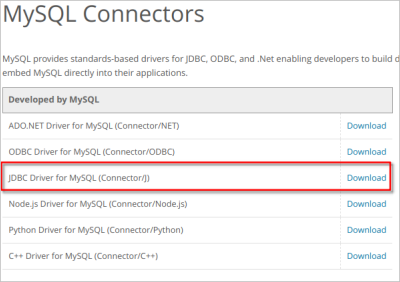

[toc]

# Controlador MySql (Manualmente - Jar)

1. El primer paso es descargar desde https://www.mysql.com/products/connector/ el conector apropiado.



2. Elegiremos la opción independiente de la Plataforma, que nos provee del archivo jar necesario (comprimido en tar.gz o zip, según nos interese):


3. Haz clic en **Donwload** y selecciona la opción: **No thanks, just start download**


4. Ahora descomprimimos el archivo descargado, que contendrá el archivo jar que nos interesa:

   `mysql-connector-j-9.0.0.jar`

 5. Ahora deberemos añadir la librería JDBC a nuestro proyecto. Este punto dependerá del IDE que estemos usando, en mi caso con IntelliJ seria en `File/Project Structure (Ctrl+Alt+Shift+S)` , y pulsar el botón `+` para añadir la libreria.

    

 6. Busca en la carpeta descomprimida el archivo `jar` y selecciónalo, te informará de que la librería se añadirá a tu proyecto (pulsa OK) y debería quedar algo así:

    

# Controlador MySql (IntelliJ - Maven)

**1. Crear un Nuevo Proyecto con Maven:**

- Al crear un nuevo proyecto en IntelliJ, selecciona "Maven" como sistema de construcción.

  

- IntelliJ generará la estructura del proyecto y el archivo `pom.xml`.

**2. Importar un Proyecto Existente con Maven:**

- Si ya tienes un proyecto con un `pom.xml`, simplemente importa el proyecto en IntelliJ y selecciona el archivo `pom.xml`. IntelliJ configurará el proyecto automáticamente.

**3. Agregar Dependencias:**

- Abre el archivo `pom.xml` y agrega las dependencias necesarias dentro de la sección `<dependencies> ` (Aquí se muestran dos, MySQL y MariaDB, por ejemplo, agrega solo una!). IntelliJ descargará y configurará automáticamente las dependencias.

```xml
[...]
	<dependencies>
        <!-- Dependencia de MySQL -->
        <dependency>
            <groupId>mysql</groupId>
            <artifactId>mysql-connector-java</artifactId>
            <version>8.0.33</version>
        </dependency>
        <!-- Dependencia de MariaDB -->
        <dependency>
            <groupId>org.mariadb.jdbc</groupId>
            <artifactId>mariadb-java-client</artifactId>
            <version>3.5.2</version>
        </dependency>        
    </dependencies>
[...]
```

4. Actualizar Dependencias:

- Si cambias el archivo `pom.xml`, IntelliJ mostrará un botón para cargar los cambios:


# Actividades

Ahora que conoces las diferencias entre agregar una libreria manualmente o mediante Maven, genera un documento pdf con el siguiente contenido:

1. Después de haber probado las dos maneras de agregar el conector `MySQL` a tu proyecto, explica que método te ha resultado más difícil. Luego, investiga si en el repositorio de central de Maven, siempre está disponible la última versión del controlador `MySQL`, crees que esto puede llegar a ser un problema?
2. Explica en tu documento como agregar los controladores (mediante Maven) para bases de datos Oracle (explica las diferencias entre el `Ojdbc8` y el `Ojdbc11`) y `SQLite`. (Capturas de pantalla y explicaciones, y capturas que demuestren que el proyecto tiene las librerías agregadas).

Envia tu fichero pdf a la tarea de Aules.

# Fuentes de información

- [Wikipedia](https://es.wikipedia.org)
- [Programación (Grado Superior) - Juan Carlos Moreno Pérez (Ed. Ra-ma)](https://www.ra-ma.es/libro/programacion-grado-superior_48302/)
- Apuntes IES Henri Matisse (Javi García Jimenez?)
- Apuntes AulaCampus
- [Apuntes José Luis Comesaña](https://www.sitiolibre.com/)
- [Apuntes IOC Programació bàsica (Joan Arnedo Moreno)](https://ioc.xtec.cat/materials/FP/Recursos/fp_asx_m03_/web/fp_asx_m03_htmlindex/index.html)
- [Apuntes IOC Programació Orientada a Objectes (Joan Arnedo Moreno)](https://ioc.xtec.cat/materials/FP/Recursos/fp_dam_m03_/web/fp_dam_m03_htmlindex/index.html)
- [FXDocs](https://github.com/FXDocs/docs)
- https://openjfx.io/openjfx-docs/
- https://arturoblasco.github.io/pr
