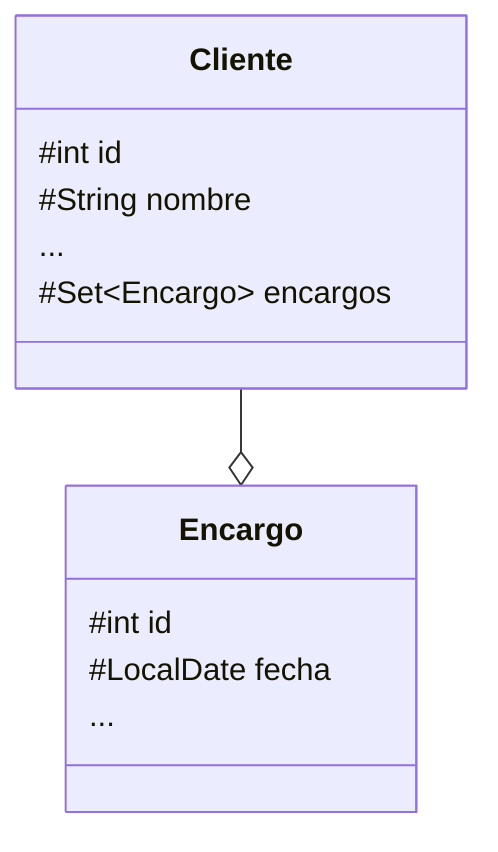

---
title: UD11: Bases de Datos Orientadas a Objetos
language: ES
author: David Martínez Peña [www.martinezpenya.es]
subject: Programación
keywords: [PRG, 2025, Programacion, Java]
IES: IES Eduardo Primo Marqués (Carlet) [www.ieseduardoprimo.es]
header: ${title} - ${subject} (ver. ${today}) 
footer:${currentFileName}.pdf - ${author} - ${IES} - ${pageNo}/${pageCount}
typora-root-url:${filename}/../
typora-copy-images-to:${filename}/../assets
---


[toc]

# Introducción

Si bien las BD relacionales son las más populares y las que más aceptan, su utilización dentro de una aplicación orientada a objetos implica un proceso de traducción del diagrama UML original a un modelo relacional, totalmente basado en tablas. En esta traducción se pierden muchas de las funcionalidades básicas de la orientación a objetos, que deben simularse de algún modo: referencias a objetos, clases asociativas, listas de objetos, herencia, etc. Cuando el diagrama es de cierta complejidad, la traducción puede resultar muy complicada.

Para resolver este problema se encuentran las BD orientadas a objetos (BDOO). Éstas, en lugar de organizar los datos en tablas, los organizan exactamente tal y como lo hace un diagrama UML, mediante la definición del conjunto de clases y relaciones entre ellas. Por tanto, no es necesario hacer ninguna traducción.

> ### Para evitar confusiones, utilizamos el término `BDR` para referirnos explícitamente a una BD relacional y el término `BDOO` para referirnos a una BD orientada a objetos, de forma que ambos queden diferenciados.

Actualmente, la aplicación de `BDOO` se limita a ámbitos muy concretos, especialmente a los vinculados a áreas científicas. Su implantación en aplicaciones comerciales a nivel general es muy baja. Uno de los principales problemas de las BDOO es que los fabricantes tienden a crear soluciones incompatibles, que no obedecen a ninguna especificación concreta. Al contrario que en el caso de las BDR, es muy posible que una aplicación cliente hecha por el producto de un fabricante concreto no funcione sobre una BDOO de otro fabricante. De hecho, a las BDOO que soportan Java no se accede mediante JDBC, puesto que este mecanismo es específico para BDR, sino que normalmente se accede usando bibliotecas específicas para cada fabricante. Java tiene una especificación para BDOO llamada JDO (Java Data Objects).

Las **bases de datos `NoSQL`** (**N**ot **O**nly **SQL**) son sistemas de almacenamiento diseñados para manejar datos no estructurados o semiestructurados, destacando por su escalabilidad horizontal, esquemas flexibles y alto rendimiento en entornos distribuidos. Incluyen modelos como documentos (`MongoDB`), clave-valor (`Redis`), columnas (`Cassandra`) y grafos (`Neo4j`), siendo ideales para Big Data, aplicaciones en tiempo real y escenarios donde las bases relacionales tradicionales resultan inflexibles.

# Los lenguajes `ODL` y `OQL`

De la misma manera que existe `SQL` como lenguaje estándar para acceder a una `BDR` independientemente del fabricante, existe un lenguaje para acceder a los datos de una `BDOO`: el lenguaje de consultas a objetos (object query language, `OQL`) . Adicionalmente, existe el lenguaje de descripción de objetos (object description language, `ODL`), que sirve para especificar el formato de una `BDOO`: qué tipo de objetos puede contener y sus relaciones. Desgraciadamente, si bien estos lenguajes están especificados, y como ya se ha dicho, no se puede contar con que cualquier fabricante realmente los soporte. De ninguna forma llegan al grado de aceptación de SQL.

## El lenguaje `ODL`

El lenguaje `ODL` se utiliza para definir clases de objetos persistentes en una `BDOO`, de modo que sus objetos se puedan almacenar. Dentro de la declaración de cada clase se incluye:

- El nombre de la clase.
- Declaraciones opcionales de claves primarias.
- La declaración de la extensión: el nombre del conjunto de instancias existentes.
- Declaraciones de elementos: atributos, relaciones o métodos.

La sintaxis es la siguiente (entre corchetes se indican campos opcionales):


```java
class nombreClase [(key nombreClavePrimaria)] {
    attribute tipoAtributo nombreAtributo;
    ...
    relationship tipo<nombreClaseDestino> nombreRelacion;
    ...
    tipoRetorno nombreMetodo(params) [raises (tipoExcepcion)]
    ...
}
```

Como puede apreciarse, simplemente es un cambio de sintaxis respecto al lenguaje Java propiamente, pero la mayoría de elementos de una clase son claramente identificables.

La única diferencia es la declaración explícita de las relaciones en forma de la palabra clave `relationship`, en contraste en Java, que se traducen a atributos. Existen diferentes tipos de relaciones según la cardinalidad que se quiere expresar. De hecho, cada uno de estos tipos tiene una cierta correspondencia con las clases que se usan en Java para implementar relaciones. Para cardinalidad 1, basta con poner el nombre de la clase destino. En caso de cardinalidad múltiple, se puede elegir entre distintos tipos:

- `<nombreClaseDestino>`, si la relación es sólo a un único objeto.
- `Set<nombreClaseDestino>`, un conjunto no ordenado sin repeticiones.
- `Bag<nombreClaseDestino>`, un conjunto no ordenado con repeticiones.
- `List<nombreClaseDestino>`, un conjunto ordenado con repeticiones, con inserciones eficientes.
- `Array<nombreClaseDestino>`, un conjunto ordenado con repeticiones.

Su significado es el mismo que el de las clases homónimas de Java (capacidad de haber repeticiones de elementos, ordenadas o no por índice, etc.). Normalmente, la más usada es `Set<nombreClaseDestino>`.

A continuación se muestra cómo podría representarse dos clases interdependientes llamadas `Cliente` y `Encargo`, que almacenan datos en una aplicación de gestión de clientes, mediante `ODL`.


```java
class Cliente (key id) {
     attribute int id;
     attribute String nombre;
     attribute String direccionPostal;
     attribute String eMail;
     attribute String telefono;
     
     relationship Set<Encargo> encargos;
     
     String getId();
     ...
}
     
class Encargo (key id)  {
     attribute int id;
     attribute LocalDate fecha;
     ...
}
```

La representación en UML seria algo parecido a esto:




La herencia entre clases se inicia en su declaración mediante la palabra clave extends seguido del nombre de la superclase:


```java
class nombreClase extends nombreSuperClase {
	...
}
```

## El lenguaje `OQL`

El lenguaje `OQL` se limita a permitir consultas sobre una `BDOO`. Su operador principal es `SELECT`, el cual tiene una gran similitud con el equivalente `SQL`. Sin embargo, tiene algunas particularidades debidas a la forma en que se estructuran los datos mediante la orientación a objetos (por ejemplo, no hay tablas, por supuesto).

La sintaxis general es:


```sql
SELECT valor1,valor2,...
FROM lista_de_colecciones y nombres_para_miembros_típicos
WHERE condición
```

Dado que ahora ya no hay tablas, es necesario tener en cuenta dos cosas. Por un lado, la lista de colecciones especificada en el apartado `FROM` corresponde a alguna de las clases declaradas. Junto al nombre de esta clase se especifica la variable que se utilizará en los términos `SELECT` y `WHERE` para referenciar valores. Por otro lado, los valores que se quieren consultar o comparar son atributos de clases, por lo que la forma de referirse a ellos es mediante la nomenclatura: `nombreClase.nombreAtributo`. Esta posibilidad también puede utilizarse para indicar sus relaciones.

Por ejemplo, en una aplicación de gestión de clientes, si se quiere consultar a los clientes de la `BDOO` de acuerdo con la definición de sus clases, se puede hacer:


```sql
SELECT c.direccionPostal, c.telefono
FROM Clientes c
WHERE c.nombre = "Cliente1"
```

Esta consulta devuelve la dirección postal y el teléfono del cliente con nombre "Cliente1".

También es posible acceder a los encargos por medio de los clientes, siguiendo su relación:


```sql
SELECT e.fecha
FROM Clientes c, c.encargos e
WHERE c.eMail = "email1@dominio.com"
```

Esta consulta devuelve la fecha de todos los encargos del cliente con dirección de correo "email1@dominio.com".

# La librería `ObjectDB`

A pesar de los esfuerzos por estandarizar el uso de las `BDOO`, no se puede decir que actualmente haya ningún equivalente al lenguaje `SQL`. Aunque sobre el papel están `ODL` y `OQL`, en la práctica ahora mismo no hay ninguna lengua franca que se pueda garantizar que está soportada, al menos en sus aspectos fundamentales, por todas las bases de datos, todo y que después cada fabricante pueda añadir igualmente sus propias extensiones propietarias. Por tanto, cada tipo de `BDOO` ofrece su propio sistema para acceder a los objetos almacenados. Afortunadamente, como verá, esto no es muy problemático, ya que la ventaja de usar una `BDOO` es poder crear código donde operar con objetos persistentes; es casi igual que trabajar con objetos en memoria, y, por tanto, los mecanismos que ofrecen las diferentes `BDOO` a menudo son muy parecidos a trabajar con objetos directamente en memoria. Lo que varía son las librerías de clases a utilizar, pero no la idea general. En este apartado se verá un caso concreto de acceso a una `BDOO` llamada **[ObjectDB](https://www.objectdb.com/)**

> # **ObjectDB** es un potente sistema de gestión de bases de datos orientado a objetos (`ODBMS`). Es compacto, fiable, fácil de usar y extremadamente rápido. **ObjectDB** proporciona todos los servicios estándar de administración de bases de datos (almacenamiento y recuperación, transacciones, administración de bloqueos, procesamiento de consultas, etc.), pero de una manera que facilita el desarrollo y acelera las aplicaciones.

> ## Características clave de la base de datos **ObjectDB**
>
> - Sistema de gestión de bases de datos orientado a objetos (ODBMS) 100% puro Java.
> - Sin API propietaria - administrado únicamente por API de Java estándar (JPA 2 / JDO 2).
> - Extremadamente rápido: más rápido que cualquier otro producto JPA/JDO.
> - Adecuado para archivos de bases de datos que van desde kilobytes hasta terabytes.
> - Admite tanto el modo Cliente-Servidor como el modo Integrado.
> - JAR único sin dependencias externas.
> - La base de datos se almacena como un único archivo.
> - Capacidades avanzadas de consulta e indexación.
> - Efectivo en entornos multiusuario con mucha carga.
> - Puede integrarse fácilmente en aplicaciones de cualquier tipo y tamaño.
> - Probado con Tomcat, Jetty, GlassFish, JBoss y Spring.

> ## **ObjectDB**, que es la `BDOO` elegida permite tanto `JDO` como `JPA` (Java Persistence API). Aunque parece que el mercado evoluciona del lado de JPA y es la modalidad más usada para dotar de persistencia a los datos. Por tanto en este tema usaremos **ObjectDB** con **JPA**.

> ### **ObjectDB** se puede descargar y utilizar **sin coste (incluso comercialmente)** con la restricción de un máximo de **10 clases de entidad** y **un millón de objetos de entidad** por archivo de base de datos. Esto podría ser útil para proyectos pequeños, tareas académicas, evaluación y aprendizaje. **ObjectDB** es un software comercial y su uso sin estas restricciones [requiere la compra de una licencia](https://www.objectdb.com/database/license).
>
> Se recomienda probar **ObjectDB** antes de comprar una licencia.
>
> Más información sobre tipos de licencias: https://www.objectdb.com/database/purchase

## Usar `ObjectDB` con `Maven`

Para usar `ObjectDB` en nuestros proyectos, lo podemos hacer de manera fácil a través de `Maven` (consulta talleres anteriores si tienes dudas sobre como usar `Maven`). Debes añadir un repositorio y una dependencia:

```xml
[...]
	<repositories>
		<repository>
			<id>objectdb</id>
			<name>ObjectDB Repository</name>
			<url>https://m2.objectdb.com</url>
		</repository>
	</repositories>

	<dependencies>
		<dependency>
			<groupId>com.objectdb</groupId>
			<artifactId>objectdb</artifactId>
			<version>2.8.1</version>
		</dependency>
	</dependencies>
[...]
```

Consulta el Taller 1 de esta unidad para realizar una introducción rápida al uso de `ObjectDB` (con `Maven`).

# Anotaciones para `ObjectDB`

Como hemos explicado anteriormente, cada BDOO utilitza su propio lenguaje ODL y OQL, a continuación presentaremos el modo de definir la estructura de la BDOO que tiene `ObjectDB`, insertando anotaciones (palabras reservadas que comienza por `@`), para definir la estructura y la persistencia de los objetos en la BDOO.

>## Aquí, por su extensión, solo veremos una parte de todo lo que se puede hacer con ObjectDB y JPA, si te interesa profundiza más, te recomiendo que acudas al manual online que tienen publicado en su web, y en el que se basan estos apuntes: https://house.objectdb.com/java/jpa

> **Porqué usamos DBOO y en concreto `ObjectDB` si requiere la compra de una licencia y además no se usa mucho en el mercado?**
>
> La ventaja de usar `ObjectDB` es que es plenamente compatible con `JPA`, y sus anotaciones son muy similares a las que deberias usar con otros [`ORM`](https://stackoverflow.com/questions/1279613/what-is-an-orm-how-does-it-work-and-how-should-i-use-one), como por ejemplo [`Hibernate`](https://es.wikipedia.org/wiki/Hibernate).
>
> `Hibernate` es un `ORM` que si se usa mucho a nivel comercial, pero no cumple con los requisitos que marca el Real Decreto que regula el ciclo superior de Desarrollo de Aplicaciones Multiplataforma. 
>
> De esta manera al estudiar `ObjectDB` nos sirve para cuando necesites usar `Hibernate` y cubrimos los requisitos del RD.

## Usando JPA

### Conexión de base de datos usando `JPA`

Trabajar con Java Persistence API (JPA) consiste en utilizar las siguientes interfaces:


**Descripción general**

Una conexión a una base de datos está representada por una instancia [EntityManager](https://www.objectdb.com/api/java/jpa/EntityManager), que también proporciona funcionalidad para realizar operaciones en una base de datos. Muchas aplicaciones requieren múltiples conexiones a bases de datos durante su vida útil. Por ejemplo, en una aplicación web es común establecer una conexión de base de datos separada, utilizando una instancia "EntityManager" separada, para cada solicitud HTTP.

La función principal de una instancia de [EntityManagerFactory](https://www.objectdb.com/api/java/jpa/EntityManagerFactory) es admitir la creación de múltiples instancias de [EntityManager](https://www.objectdb.com/api/java /jpa/EntityManager). Una `EntityManagerFactory` se construye para una base de datos específica y, al administrar los recursos de manera eficiente (por ejemplo, un grupo de sockets), proporciona una manera eficiente de construir múltiples instancias de `EntityManager` para esa base de datos. La creación de instancias de `EntityManagerFactory` en sí puede ser menos eficiente, pero es una operación única. Una vez construido, puede servir para toda la aplicación.

Las operaciones que modifican el contenido de una base de datos requieren transacciones activas. Las transacciones son administradas por una instancia de [EntityTransaction](https://www.objectdb.com/api/java/jpa/EntityTransaction) obtenida del `EntityManager`.

Una instancia de `EntityManager` también funciona como una fábrica para instancias de [Query](https://www.objectdb.com/api/java/jpa/Query), que son necesarias para ejecutar consultas en la base de datos.

Cada implementación de JPA define clases que implementan estas interfaces. Cuando utiliza `ObjectDB`, trabaja con instancias de clases de `ObjectDB` que implementan estas interfaces y, debido a que se utilizan interfaces JPA estándar, su aplicación es portable.

**`EntityManagerFactory`**

Una instancia de [EntityManagerFactory](https://www.objectdb.com/api/java/jpa/EntityManagerFactory) se obtiene utilizando un método estático de la clase base de JPA, [Persistence](https://www.objectdb. com/api/java/jpa/Persistence):


```java
EntityManagerFactory emf = Persistence.createEntityManagerFactory("objectdb:myDbFile.odb");
```

La instancia [EntityManagerFactory](https://www.objectdb.com/api/java/jpa/EntityManagerFactory), cuando se construye, abre la base de datos. Si la base de datos aún no existe, se crea un nuevo archivo de base de datos.

Cuando la aplicación termine de usar `EntityManagerFactory`, debe cerrarse:


```java
emf.close();
```

Al cerrar `EntityManagerFactory`, se cierra el archivo de base de datos.

**URL de conexión**

El método [createEntityManagerFactory](https://www.objectdb.com/api/java/jpa/Persistence/createEntityManagerFactory_String) toma como argumento el nombre de una [unidad de persistencia](https://www.objectdb.com/java /jpa/entity/persistence-unit). Como extensión, `ObjectDB` permite especificar una URL (o ruta) de base de datos directamente, evitando la necesidad de una unidad de persistencia. `ObjectDB` considera que cualquier cadena que comience con `objectdb:` o termine con `.odb` o `.objectdb` es una URL de base de datos en lugar de un nombre de unidad de persistencia.

Para utilizar `ObjectDB` integrado directamente en su aplicación (modo integrado), se debe especificar una ruta absoluta o relativa de un archivo de base de datos local (por ejemplo, `"my.odb"`). Especificar el protocolo `objectdb:` como prefijo (p. ej., `"objectdb:my.odb"`) es opcional si la extensión del nombre del archivo de la base de datos es `odb` u `objectdb` y es necesario para otras extensiones de nombre de archivo (p. ej., `"objectdb:mi-db.tmp"`).

Para utilizar el modo cliente-servidor, se debe especificar una URL con el formato `objectdb://host:puerto/ruta`. En este caso, se espera que se ejecute un [Servidor de base de datos ObjectDB](https://www.objectdb.com/java/jpa/tool/server) en una máquina llamada host (podría ser un nombre de dominio o una dirección IP) y escuchando en el puerto especificado (el valor predeterminado es 6136 cuando no se especifica). La ruta indica la ubicación del archivo de base de datos en el servidor, en relación con la ruta [raíz de datos del servidor](https://www.objectdb.com/java/jpa/setting/server#the_data_element).

**Administrador de entidades**

Una instancia de [EntityManager](https://www.objectdb.com/api/java/jpa/EntityManager) puede representar una conexión remota a un servidor de base de datos remoto (en modo cliente-servidor) o una conexión local a un archivo de base de datos local (en modo incrustado). La funcionalidad en ambos casos es la misma. Dada una [EntityManagerFactory](https://www.objectdb.com/api/java/jpa/EntityManagerFactory) `emf`, una conexión a corto plazo a la base de datos podría tener la siguiente forma:


```java
EntityManager em = emf.createEntityManager();
try {
    // TODO: Usar la EntityManager para acceder a la BDOO
}
finally {
    em.close();
}
```

La instancia `EntityManager` se obtiene de la instancia propietaria `EntityManagerFactory`. Llamar al método [close](https://www.objectdb.com/api/java/jpa/EntityManager/close) es esencial para liberar recursos (como un socket en modo cliente-servidor) a la `EntityManagerFactory` propietaria. .

**Entidad de Transacción**

Las operaciones que afectan el contenido de la base de datos (almacenar, actualizar, eliminar) deben realizarse dentro de una transacción activa. La interfaz [EntityTransaction](https://www.objectdb.com/api/java/jpa/EntityTransaction) representa y administra transacciones de bases de datos. Cada [EntityManager](https://www.objectdb.com/api/java/jpa/EntityManager) contiene una única instancia adjunta `EntityTransaction` que está disponible a través de [getTransaction()](https://www.objectdb.com/ api/java/jpa/EntityManager/getTransaction):


```java
try {
    em.getTransaction().begin();
    // Operaciones que modifican la base de datos se realizan aquí.
    em.getTransaction().commit();
}
finally {
    if (em.getTransaction().isActive())
        em.getTransaction().rollback();
}
```

Una transacción se inicia con una llamada a [begin](https://www.objectdb.com/api/java/jpa/EntityTransaction/begin) y finaliza con una llamada a [commit](https://www.objectdb .com/api/java/jpa/EntityTransaction/commit) o ​​[rollback](https://www.objectdb.com/api/java/jpa/EntityTransaction/rollback). Todas las operaciones en la base de datos dentro de estos límites están asociadas con esa transacción y se mantienen en la memoria hasta que finaliza la transacción. Si la transacción finaliza con una "reversión" (roll-back), todas las modificaciones a la base de datos se descartan. Sin embargo, de forma predeterminada, la instancia en memoria de la entidad gestionada no se ve afectada por la reversión y no vuelve a su estado modificado previamente.

Finalizar una transacción con un "commit" propaga todas las modificaciones físicamente a la base de datos. Si por algún motivo falla una "commit", la transacción se revierte automáticamente (incluidas las modificaciones que ya se han propagado a la base de datos antes del error) y se genera una [RollbackException](https://www.objectdb.com/ api/java/jpa/RollbackException).

### Trabajar con objetos de entidad `JPA`

Los objetos de entidad son instancias en memoria de [clases de entidad](https://www.objectdb.com/java/jpa/entity/types#entity_classes) (clases persistentes definidas por el usuario), que pueden representar objetos físicos en la base de datos.

Administrar una base de datos de objetos `ObjectDB` usando JPA requiere el uso de objetos de entidad para muchas operaciones, incluido el almacenamiento, recuperación, actualización y eliminación de objetos de la base de datos.

**Ciclo de vida del objeto de entidad**

El ciclo de vida de los objetos de entidad consta de cuatro estados: Nuevo, Administrado, Eliminado y Separado.


Cuando se crea inicialmente un objeto de entidad, su estado es **Nuevo**. En este estado, el objeto aún no está asociado con un [EntityManager](https://www.objectdb.com/api/java/jpa/EntityManager) y no tiene representación en la base de datos.

Un objeto de entidad pasa a ser **Administrado** cuando persiste en la base de datos a través del método `EntityManager's` [persist](https://www.objectdb.com/api/java/jpa/EntityManager/persist_Object), que debe ser invocado dentro de una transacción activa. Al confirmar la transacción, el `EntityManager` propietario almacena el nuevo objeto de entidad en la base de datos.

Los objetos de entidad recuperados de la base de datos por un "EntityManager" también están en el estado **Administrado**.

Si un objeto de entidad administrada se modifica dentro de una transacción activa, el "EntityManager" propietario detecta el cambio y la actualización se propaga a la base de datos al confirmar la transacción.

Un objeto de entidad administrada también se puede recuperar de la base de datos y marcar para su eliminación, utilizando el método [remove](https://www.objectdb.com/api/java/jpa/EntityManager/remove_Object) dentro de una transacción activa. El objeto de entidad cambia su estado de Administrado a **Eliminado** y se elimina físicamente de la base de datos durante la confirmación de la transacción.

El último estado, **Separado**, representa objetos de entidad que se han desconectado del `EntityManager`. Por ejemplo, todos los objetos administrados de un "EntityManager" se desconectan cuando se cierra el "EntityManager".

**El contexto de persistencia**

El contexto de persistencia es la colección de todos los objetos administrados de un "EntityManager". Si un objeto de entidad que debe recuperarse ya existe en el contexto de persistencia, el objeto de entidad gestionado existente se devuelve sin acceder realmente a la base de datos (excepto la recuperación mediante [refresh](https://www.objectdb.com/api/java/ jpa/EntityManager/refresh_Object_LockModeType), que siempre requiere acceder a la base de datos).

El contexto de persistencia se puede borrar utilizando el método [clear](https://www.objectdb.com/api/java/jpa/EntityManager/clear): 


```java
em.clear();
```

Cuando se borra el contexto de persistencia, todas sus entidades administradas se desconectan y se descarta cualquier cambio en los objetos de entidad que no se hayan vaciado a la base de datos.

## Clases de entidad `JPA`

### Clases de entidad

Una clase de entidad es una clase Java ordinaria definida por el usuario cuyas instancias se pueden almacenar en la base de datos. La forma sencilla de declarar una clase como entidad es marcarla con la anotación [@Entity](https://www.objectdb.com/api/java/jpa/Entity):

```java
import javax.persistence.Entity;

@Entity
public class MyEntity {

}
```

**Requisitos de clase de entidad**

Una clase de entidad JPA persistente:

- debe ser una clase de nivel superior (es decir, no una clase anidada/interna).
- debe tener un constructor sin argumentos `público` o `protegido`.
- no puede ser `final` y no puede tener métodos "finales" o variables de instancia "finales".

`ObjectDB` es un poco menos restrictivo:

- Se permiten clases de entidades anidadas estáticas (se prohíben las clases internas no estáticas).
- Las variables de instancia (no estáticas) no pueden ser finales, pero las clases y métodos pueden ser finales.
- En la mayoría de los casos, `ObjectDB` puede superar la falta de un constructor sin argumentos.

Aparte de estas restricciones, una clase de entidad es como cualquier otra clase de Java. Puede extender otra clase de entidad o una clase definida por el usuario que no sea una entidad (pero no clases del sistema, como `ArrayList`) e implementar cualquier interfaz. Puede contener constructores, métodos, campos y tipos anidados con cualquier modificador de acceso (público, protegido, paquete o privado) y puede ser concreta o abstracta.

### Tipos de datos Java simples

Todos los siguientes tipos de datos Java simples son persistentes:

- Tipos primitivos: `boolean`, `byte`, `short`, `char`, `int`, `long`, `float` y `double`.
- Clases contenedoras (`Wrappers`) equivalentes del paquete `java.lang`: `Boolean`, `Byte`, `Short`, `Char`, `Integer`, `Long`, `Float` y `Double`.
- `java.math.BigInteger`, `java.math.BigDecimal`.
- `java.lang.String`.
- `java.util.Date`, `java.util.Calendar`, `java.sql.Date`, `java.sql.Time`, `java.sql.Timestamp`.

Los tipos de fecha y hora se analizan con más detalle en el siguiente párrafo.

### Tipos de fecha y hora (temporales)

Las clases de fecha y hora `java.sql` representan diferentes partes de fechas y horas:

- `java.sql.Date`: representa solo la fecha (por ejemplo, `2019-12-31`).
- `java.sql.Time`: representa solo el tiempo (por ejemplo, `23:59:59`).
- `java.sql.Timestamp`: representa la fecha y la hora (por ejemplo, `2019-12-31 23:59:59`).

Los tipos `java.util.Date` y `java.util.Calendar`, por otro lado, son genéricos y pueden representar cualquiera de los anteriores, usando la anotación   [@Temporal](https://www.objectdb.com/ api/java/jpa/Temporal):

```java
@Entity
public class DatesAndTimes {
    // Date Only:
    java.sql.Date date1;
    @Temporal(TemporalType.DATE) java.util.Date date2;
    @Temporal(TemporalType.DATE) java.util.Calendar date3;

    // Time Only:
    java.sql.Time time1;
    @Temporal(TemporalType.TIME) java.util.Date time2;
    @Temporal(TemporalType.TIME) java.util.Calendar time3;

    // Date and Time:
    java.sql.Timestamp dateAndTime1;
    @Temporal(TemporalType.TIMESTAMP) java.util.Date dateAndTime2;
    @Temporal(TemporalType.TIMESTAMP) java.util.Calendar dateAndTime3;
    java.util.Date dateAndTime4; // date and time, not JPA portable
    java.util.Calendar dateAndTime5; // date and time, not JPA portable  
}
```

Fechas puras persistentes (sin la parte de tiempo), ya sea usando el tipo `java.sql.Date` o especificando [@Temporal](https://www.objectdb.com/api/java/jpa/Temporal) La anotación [TemporalType](https://www.objectdb.com/api/java/jpa/TemporalType).[DATE](https://www.objectdb.com/api/java/jpa/TemporalType/DATE) tiene varios beneficios:

- Ahorra espacio en la base de datos.
- Es más eficiente (el almacenamiento y la recuperación son más rápidos).
- Simplifica las consultas sobre fechas y rangos de fechas.

Cuando se almacena una entidad, sus campos de fecha y hora se ajustan automáticamente al modo solicitado. Por ejemplo, los campos `fecha1`, `fecha2` y `fecha3` anteriores pueden inicializarse como `new Date()`, es decir, con fecha y hora. Su parte de tiempo se descarta cuando se almacenan en la base de datos.

### Tipos de valores múltiples

Los siguientes tipos de valores múltiples son persistentes:

- Tipos de colección del paquete `java.util`: ` ArrayList`, `Vector`, `Stack`, `LinkedList`, `ArrayDeque`, `PriorityQueue`, `HashSet`, `LinkedHashSet`, `TreeSet`.
- Tipos de mapas del paquete `java.util`: ` HashMap`, `HashTable`, `WeakHashMap`, `IdentityHashMap`, `LinkedHashMap`, `TreeMap` y `Properties`.
- Arrays (incluidos los multidimensionales (Matrices)).

Se admiten tipos de colecciones y mapas tanto genéricos (por ejemplo, `ArrayList<String>`) como no genéricos (por ejemplo, `ArrayList`), siempre que sus valores (es decir, elementos en colecciones y matrices y claves y valores en mapas) sean valores nulos o instancias de tipos persistentes.

Además de las clases de colección y mapa que son totalmente compatibles con `ObjectDB`, se puede utilizar cualquier otra clase que implemente `java.util.Collection` o `java.util.Map` al almacenar entidades. Si se utiliza una colección o un tipo de mapa no compatible, `ObjectDB` cambiará a un tipo compatible similar cuando se recuperen los datos de la base de datos.

Por ejemplo, el método `Arrays.asList` devuelve una instancia de un tipo de colección Java interna que no es compatible con `ObjectDB`. Sin embargo, se puede almacenar la siguiente entidad:

```java
@Entity
public class EntityWithList {
    private List<String> words = Arrays.asList("not", "ArrayList");
}
```

Cuando la entidad se recupera de la base de datos, la lista se creará como una "ArrayList". En este caso, es esencial usar una interfaz (`List<String>`) para el tipo de campo para permitir el cambio al tipo de colección admitido cuando se recupera la entidad. En realidad, JPA requiere declarar campos de mapas y colecciones persistentes solo como tipos de interfaz (es decir, `java.util.Collection`, `java.util.List`, `java.util.Set`, `java.util.Map`), y Esa también es una buena práctica cuando se trabaja con `ObjectDB`.


## Campos de entidad `JPA`

Los campos de clases persistentes definidas por el usuario (clases de entidad) se pueden clasificar en los siguientes cinco grupos:

- Campos *transient*
- Campos persistentes
- Compos incrustables
- Campos inversos (mapeados por)
- Campos de clave primaria (ID)
- Campo de versión

### Campos *transient*

Son campos que no participan en la persistencia y sus valores nunca se almacenan en la base de datos (similar a los campos *transient* en Java que no participan en la serialización). Los campos de entidad estática y final siempre se consideran *transient*. Otros campos se pueden declarar explícitamente como *transient* usando el modificador `transient` de Java (que también afecta la serialización) o la anotación JPA [@Transient](https://www.objectdb.com/api/java/jpa/Transient) (que sólo afecta la persistencia):

```java
@Entity
public class EntityWithTransientFields {
    static int transient1; // no persistente por ser estático
    final int transient2 = 0; // no persistente por ser final
    transient int transient3; // no persistente por ser transient
    @Transient int transient4; // no persistente por el uso de la etiqueta @Transient
}
```

La clase de entidad anterior contiene solo campos de entidad *transient* (no persistentes) sin contenido real para almacenar en la base de datos.

### Campos persistentes

Cada campo de entidad no estático y no final es persistente de forma predeterminada a menos que se especifique explícitamente lo contrario (por ejemplo, mediante el uso de la anotación [@Transient](https://www.objectdb.com/api/java/jpa/Transient)).

Almacenar un objeto de entidad en la base de datos no almacena métodos ni código. Sólo se almacena el estado persistente del objeto de entidad, tal como lo reflejan sus campos persistentes (incluidos los campos persistentes que se heredan de las clases antecesoras).

Cuando un objeto de entidad se almacena en la base de datos, cada campo persistente debe contener "nulo" o un valor de uno de los [tipos persistentes](https://www.objectdb.com/java/jpa/entity/types) admitidos. `ObjectDB` admite campos persistentes con cualquier tipo estático declarado, incluido un `java.lang.Object` genérico, siempre que el tipo del valor real en tiempo de ejecución sea persistente (o `null`).

Cada campo persistente se puede marcar con una de las siguientes anotaciones:

- [OneToOne](https://www.objectdb.com/api/java/jpa/OneToOne), [ManyToOne](https://www.objectdb.com/api/java/jpa/ManyToOne) - para referencias de tipos de entidad.
- [OneToMany](https://www.objectdb.com/api/java/jpa/OneToMany), [ManyToMany](https://www.objectdb.com/api/java/jpa/ManyToMany) - para colecciones y mapas de tipos de entidades.
- [Básico](https://www.objectdb.com/api/java/jpa/Basic)- para cualquier otro tipo persistente.

En JPA solo [Básico](https://www.objectdb.com/api/java/jpa/Basic) es opcional, mientras que las otras anotaciones anteriores son obligatorias cuando corresponda. `ObjectDB`, sin embargo, no exige el uso de ninguna de estas anotaciones, por lo que son útiles sólo para clases que también se utilizan con un proveedor ORM JPA (como Hibernate) o para cambiar la configuración de campo predeterminada. Por ejemplo:

```java
@Entity
public class EntidadConAtributosPersistentes {
    @Basic(optional=false) Integer campo1;
    @OneToOne(cascade=CascadeType.ALL) MiEntidad campo2;
    @OneToMany(fetch=FetchType.EAGER) List<MiEntidad> campo3;
}
```

La declaración de clase de entidad anterior demuestra el uso de anotaciones de campos y relaciones para cambiar el comportamiento predeterminado. Los valores "nulo" están permitidos de forma predeterminada. Al especificar "`optional=false`" (como se ha visto para "campo1") se genera una excepción en cualquier intento de almacenar una entidad con un valor "nulo" en ese campo. Las configuraciones de cascada y recuperación se explican más adelante.

### Campos incrustables

Especifica un campo o propiedad persistente de una entidad cuyo valor es una instancia de una clase integrable. La clase integrable debe estar anotada como Integrable.

Estan muy relacionados con las clases incrustables.

### Clases incrustables (Embeddable Classes)

Las clases incrustables son clases persistentes definidas por el usuario que funcionan como tipos. Al igual que con otros tipos que no son de entidad, las instancias de una clase **incrustable** solo pueden almacenarse en la base de datos como objetos **embedded**, es decir, como parte de un objeto de entidad.

Una clase se declara como **incrustable** marcándola con la anotación [Embeddable](https://www.objectdb.com/api/java/jpa/Embeddable):

```java
@Embeddable public class Address {
    protected String street;
    protected String city;
    protected String state;
    @Embedded protected Zipcode zipcode;
}

@Embeddable public class Zipcode {
    protected String zip;
    protected String plusFour;
}
```

Las instancias de clases integrables siempre se integran en otros objetos de entidad y no requieren asignación de espacio ni operaciones de almacenamiento y recuperación independientes. Por lo tanto, el uso de clases integrables puede ahorrar espacio en la base de datos y mejorar la eficiencia.

Sin embargo, las clases integrables no tienen una identidad (clave principal) propia, lo que conlleva algunas limitaciones (por ejemplo, sus instancias no pueden ser compartidas por diferentes objetos de entidad y no pueden consultarse directamente). Por lo tanto, la decisión de declarar una clase como entidad o integrable debe analizarse caso por caso.

### Campos inversos

Los campos inversos (o mapeados por) contienen datos que no se almacenan como parte de la entidad en la base de datos, pero que aún están disponibles después de su recuperación mediante una consulta automática especial.

> ### La navegación a través de campos inversos es **mucho menos eficiente** que la navegación a través de campos persistentes ordinarios, ya que requiere la ejecución de consultas. Los campos inversos son esenciales para los campos de colección cuando se usan implementaciones ORM JPA, **pero no cuando se usa `ObjectDB`**. 

### Campo de versión

`ObjectDB` mantiene un número de versión para cada objeto de entidad. La versión inicial de un nuevo objeto de entidad (cuando se almacena en la base de datos por primera vez) es 1. Por cada transacción en la que se modifica un objeto de entidad, su número de versión aumenta automáticamente en uno. 

Puede exponer las versiones de los objetos de entidad y hacer que sus valores sean accesibles para su aplicación marcando los campos de versión en sus clases de entidad con la anotación [@Version](https://www.objectdb.com/api/java/jpa/Version). Además, un campo de versión debe tener un tipo numérico:


```java
@Entity public class EntityWithVersionField {
     @Version long version;
}
```

Si existe un campo de versión, `ObjectDB` inyecta automáticamente el valor de la versión en ese campo. Los campos de versión deben ser tratados como de solo lectura por la aplicación y no se deben escribir métodos mutadores en ellos. Solo se permite un campo de versión por clase de entidad. De hecho, un único campo de versión por jerarquía de clases de entidad es suficiente porque las subclases heredan un campo de versión.


### Acceso a las propiedades (atributos)

Cuando una entidad se almacena en la base de datos, los datos se extraen de los campos persistentes de esa entidad. Asimismo, cuando se recupera una entidad, los campos persistentes se inicializan con datos de la base de datos.

De forma predeterminada, `ObjectDB` accede a los campos directamente, pero también se admite el acceso a los campos indirectamente como propiedades utilizando los métodos `get` y `set`. En algunas implementaciones de `JPA`, como Hibernate, el uso del acceso a propiedades puede tener algunos beneficios de rendimiento. Este no es el caso de `ObjectDB`. Por lo tanto, considerando la complejidad adicional que implica configurar y mantener el acceso a la propiedad, generalmente se prefiere el modo de acceso al campo predeterminado.

## Clave primaria `JPA`

Cada objeto de entidad que se almacena en la base de datos tiene una clave principal. Una vez asignada, la clave principal no se puede modificar. Representa el objeto de entidad mientras exista en la base de datos.

Como base de datos de objetos, `ObjectDB` admite ID de objetos implícitos, por lo que no se requiere una clave primaria definida explícitamente. Pero `ObjectDB` también admite claves primarias JPA estándar explícitas, incluidas [claves primarias compuestas](https://www.objectdb.com/java/jpa/entity/id#composite_primary_key) y automática [generación de valores secuenciales](https://www .objectdb.com/java/jpa/entity/generated). Esta es una característica muy poderosa de `ObjectDB` que está ausente en otras bases de datos orientadas a objetos.

### Identificación de entidad

Cada objeto de entidad en la base de datos se identifica de forma única (y puede [recuperarse](https://www.objectdb.com/java/jpa/persistence/retrieve) de la base de datos) mediante la combinación de su tipo y su clave principal. Los valores de clave principal son únicos por clase de entidad. Sin embargo, las instancias de diferentes clases de entidades pueden compartir el mismo valor de clave principal.

Sólo los objetos de entidad tienen claves primarias. Las instancias de otros [tipos persistentes](https://www.objectdb.com/java/jpa/entity/types) siempre se almacenan como parte de los objetos de entidad que los contienen y no tienen su propia identidad separada.

### Clave primaria automática

De forma predeterminada, la clave principal es un número secuencial de 64 bits (`long`) que `ObjectDB` establece automáticamente para cada nuevo objeto de entidad que se almacena en la base de datos. La clave principal del primer objeto de entidad en la base de datos es 1, la clave principal del segundo objeto de entidad es 2, etc. Los valores de clave principal **no** se reciclan cuando los objetos de entidad se eliminan de la base de datos.

Se puede acceder al valor de clave principal de una entidad declarando un campo de clave principal:


```java
@Entity
public class Project {
    @Id @GeneratedValue long id; // Es generado por ObjectDB
    [...]
}
```

La anotación [@Id](https://www.objectdb.com/api/java/jpa/Id) marca un campo como campo de clave principal. Cuando se define un campo de clave principal, `ObjectDB` inyecta automáticamente el valor de la clave principal en ese campo.

La anotación [@GeneratedValue](https://www.objectdb.com/api/java/jpa/GeneratedValue) especifica que `ObjectDB` asigna automáticamente la clave principal.

### Clave principal del conjunto de aplicaciones

Si una entidad tiene un campo de clave principal que no está marcado con [@GeneratedValue](https://www.objectdb.com/api/java/jpa/GeneratedValue), el valor de clave principal automático no se genera y la aplicación es responsable de establezca una clave principal inicializando el campo de clave principal. Esto debe hacerse antes de cualquier intento de persistir el objeto de entidad:


```java
@Entity
public class Project {
    @Id long id; // Necesita ser generado por la aplicación
    [...]
}
```

## Operaciones CRUD con `JPA`

### Almacenamiento de objetos de entidad `JPA`

**Persistencia explícita**

El siguiente código almacena una instancia de la clase de entidad "Empleado" en la base de datos:


```java
Empleado empleado = new Empleado("Samuel", "Perez", "Garcia");
em.getTransaction().begin();
em.persist(empleado);
em.getTransaction().commit();
```

La instancia `Empleado` se construye como un objeto Java ordinario y su [estado](https://www.objectdb.com/java/jpa/persistence/managed#entity_object_life_cycle) inicial es Nuevo. Una llamada explícita a [persist](https://www.objectdb.com/api/java/jpa/EntityManager/persist_Object) asocia el objeto con un  [EntityManager](https://www.objectdb.com/api/ java/jpa/EntityManager) `em` y cambia su estado a **Administrado**. El nuevo objeto de entidad se almacena en la base de datos cuando se confirma la transacción.

**Objetos incrustados referenciados**

El siguiente código almacena una instancia de "`Empleado`" con una referencia a una instancia de "`Direccion`":


```java
Empleado empleado = new Empleado("Samuel", "Perez", "Garcia");
Direccion direccion = new Direccion("Carlet", "España");
empleado.setDireccion(direccion);

em.getTransaction().begin();
em.persist(empleado);
em.getTransaction().commit();
```

Las instancias de [tipos persistentes](https://www.objectdb.com/java/jpa/entity/types) que no sean clases de entidad se almacenan automáticamente incrustadas en los objetos de entidad que las contienen. Por lo tanto, si `Dirección` se define como una [clase incrustable](https://www.objectdb.com/java/jpa/entity/types#embeddable_classes), el objeto de entidad `Empleado` se almacena automáticamente en la base de datos con su instancia de `Direccion` como un objeto incrustado.

Tenga en cuenta que los objetos incrustados no pueden ser compartidos por varios objetos de entidad. Cada objeto de entidad contenedora debe tener sus propios objetos incrustados.

### Recuperar objetos de entidad `JPA`

La API de persistencia de Java (JPA) proporciona varias formas de recuperar objetos de la base de datos. La recuperación de objetos no requiere una transacción activa porque no cambia el contenido de la base de datos.

**Recuperación por clase y clave principal**

Cada objeto de entidad puede identificarse y recuperarse de forma única mediante la combinación de su clase y su clave principal. Dado un [EntityManager](https://www.objectdb.com/api/java/jpa/EntityManager) `em`, el siguiente fragmento de código demuestra la recuperación de un objeto "`Empleado`" cuya clave principal es 1:


```java
Employee empleado = em.find(Empleado.class, 1);
```

No es necesario convertir el objeto recuperado a `Empleado` porque [find](https://www.objectdb.com/api/java/jpa/EntityManager/find_Class__Object) se define como devolver una instancia de la misma clase que toma como primer argumento (usando genéricos).

**Recuperación mediante Eager Fetch** (Recuperación ansiosa)

La recuperación de un objeto de entidad de la base de datos puede provocar la recuperación automática de objetos de entidad adicionales. De forma predeterminada, una operación de recuperación se realiza automáticamente en cascada a través de todos los campos persistentes que no son de colección y de mapa (es decir, a través de relaciones uno a uno y muchos a uno). Por lo tanto, cuando se recupera un objeto de entidad, también se recuperan todos los objetos de entidad a los que se puede acceder desde él mediante la navegación a través de campos persistentes de mapa y no de colección. En teoría, en algunas situaciones extremas esto podría provocar la recuperación de toda la base de datos en la memoria, lo que suele ser inaceptable.

Un campo de referencia persistente se puede excluir de esta recuperación automática en cascada mediante el uso de un tipo de recuperación diferida (**Lazy Fetch**):


```java
@Entity
class Empleado {
    [...]
    @ManyToOne(fetch=FetchType.LAZY)
    private Empleado gerente;
    [...]
}
```

El valor predeterminado para campos no mapeados y que no son de colección es [FetchType](https://www.objectdb.com/api/java/jpa/FetchType).[EAGER](https://www.objectdb.com/api/java/ jpa/FetchType/EAGER), lo que indica que la operación de recuperación se realiza en cascada a través del campo. Especificando explícitamente [FetchType](https://www.objectdb.com/api/java/jpa/FetchType).[LAZY](https://www.objectdb.com/api/java/jpa/FetchType/LAZY) en ya sea en las anotaciones [@OneToOne](https://www.objectdb.com/api/java/jpa/OneToOne) o [@ManyToOne](https://www.objectdb.com/api/java/jpa/ManyToOne) excluye el campo de participar en la recuperación en cascada.

Por otro lado, la política de recuperación predeterminada de los campos mapeados y colecciones persistentes es `FetchType.LAZY`. Por lo tanto, de forma predeterminada, cuando se recupera un objeto de entidad, cualquier otro objeto de entidad a los que haga referencia a través de su colección y los campos de mapa no se recuperan con él.

Esto se puede cambiar mediante una configuración explícita de `FetchType.EAGER`:


```java
@Entity
class Empleado {
    [...]
    @ManyToMany(fetch=FetchType.EAGER)
    private Collection<Proyecto> proyectos;
    [...]
}
```

**Recuperación por Navegación y Acceso**

Se puede acceder libremente a todos los campos persistentes de un objeto de entidad, independientemente de la política de recuperación actual, siempre que el "EntityManager" esté abierto. Esto también incluye campos que hacen referencia a objetos de entidad que aún no se han cargado desde la base de datos y están representados por objetos vacios. Si el `EntityManager` está abierto cuando se accede por primera vez a un objeto vacio, su contenido se recupera automáticamente de la base de datos y todos sus campos persistentes se inicializan.

Desde el punto de vista del desarrollador, parece que todo el esquema de objetos está presente en la memoria. Esta ilusión, que se basa en la activación y recuperación transparente y diferida de objetos por parte de `ObjectDB`, ayuda a ocultar parte de la interacción directa con la base de datos y facilita la programación de la base de datos.

Por ejemplo, después de recuperar una instancia de "Empleado" de la base de datos, el campo "gerente" puede incluir un objeto de entidad "Empleado" vacio:


```java
Empleado empleado = em.find(Empleado.class, 1);
Empleado gerente = employee.getGerente(); // puede estar vacio
```

Si `gerente` esta vacío, la activación se produce cuando se accede por primera vez. Por ejemplo: 


```java
String nombreGerente = gerente.getNombre();
```

Acceder a un campo persistente en un objeto vacio (por ejemplo, el nombre del "gerente" en el ejemplo anterior) provoca la recuperación del contenido faltante de la base de datos y la inicialización de todos los campos persistentes.

Como se ve, todo el esquema de objetos está disponible para la navegación, independientemente de la política de recuperación. Sin embargo, la política de recuperación sí afecta el rendimiento. 


### Actualización de objetos de entidad JPA

La modificación de objetos de entidad existentes que están almacenados en la base de datos se basa en la persistencia transparente, lo que significa que los cambios se detectan y manejan automáticamente.

**Actualización transparente**

Una vez que un objeto de entidad se recupera de la base de datos (sin importar de qué manera), simplemente se puede modificar en la memoria desde dentro de una transacción activa:


```java
Empleado empleado = em.find(Empleado.class, 1);

em.getTransaction().begin();
empleado.setApodo("Juan Nadie");
em.getTransaction().commit();
```

El objeto de entidad se actualiza físicamente en la base de datos cuando se confirma la transacción. Si la transacción se revierte y no se confirma, la actualización se descarta.

**Seguimiento automático de cambios**

Como se muestra arriba, una actualización se logra modificando un objeto de entidad gestionada desde dentro de una transacción activa. No se invoca ningún método de [EntityManager](https://www.objectdb.com/api/java/jpa/EntityManager) para informar la actualización. Por lo tanto, para poder aplicar actualizaciones de la base de datos al confirmar, `ObjectDB` debe detectar automáticamente los cambios en las entidades administradas. 

Sin embargo, detectar cambios en las matrices requiere el uso de instantáneas incluso si las clases de entidad están mejoradas. Por lo tanto, por motivos de eficiencia, el comportamiento predeterminado de ObjectDB ignora los cambios de matriz cuando se utilizan clases de entidad mejoradas.

Generalmente se recomienda utilizar colecciones en lugar de matrices cuando se utiliza JPA. Las colecciones son más portátiles para las implementaciones ORM JPA y brindan un mejor soporte de seguimiento automático de cambios.

### Eliminación de objetos de entidad JPA

Los objetos de entidad existentes se pueden eliminar de la base de datos ya sea explícitamente invocando el método [remove](https://www.objectdb.com/api/java/jpa/EntityManager/remove_Object) o implícitamente como resultado de una operación en cascada.

**Eliminación explícita**

Para eliminar un objeto de la base de datos, primero debe recuperarse (sin importar de qué manera) y luego, en una transacción activa, se puede eliminar usando [eliminar](https://www.objectdb.com/api/ java/jpa/EntityManager/remove_Object):


```java
Empleado empleado = em.find(Empleado.class, 1);

em.getTransaction().begin();
em.remove(empleado);
em.getTransaction().commit();
```

El objeto de entidad se elimina físicamente de la base de datos cuando se confirma la transacción. También se eliminan los objetos incrustados contenidos en el objeto de entidad. Si la transacción se revierte y no se confirma, el objeto no se elimina.

## Consultas JPA

### API de consulta JPA

Las consultas se representan en JPA 2 mediante dos interfaces: la antigua interfaz [Query](https://www.objectdb.com/api/java/jpa/Query), que era la única interfaz disponible para representar consultas en JPA 1, y la nueva interfaz [TypedQuery](https://www.objectdb.com/api/java/jpa/TypedQuery) que se introdujo en JPA 2. La interfaz [TypedQuery](https://www.objectdb.com/api/java /jpa/TypedQuery) amplía la interfaz [Query](https://www.objectdb.com/api/java/jpa/Query).

En JPA 2, la interfaz [Query](https://www.objectdb.com/api/java/jpa/Query) debe usarse principalmente cuando el tipo de resultado de la consulta es desconocido o cuando una consulta devuelve resultados polimórficos y el mínimo común conocido. El denominador de todos los objetos resultantes es "Objeto". Cuando se espera un tipo de resultado más específico, las consultas normalmente deben utilizar la interfaz [TypedQuery](https://www.objectdb.com/api/java/jpa/TypedQuery). Es más fácil [ejecutar consultas](https://www.objectdb.com/java/jpa/query/execute) y procesar los resultados de la consulta de forma segura cuando se utiliza la interfaz `TypedQuery`.

**Creación de consultas con createQuery**

Como ocurre con la mayoría de las otras operaciones en JPA, el uso de consultas comienza con un [EntityManager](https://www.objectdb.com/api/java/jpa/EntityManager) (representado por `em` en los siguientes fragmentos de código), que sirve como fábrica tanto para [Query](https://www.objectdb.com/api/java/jpa/Query) como para [TypedQuery](https://www.objectdb.com/api/java/jpa/TypedQuery) :


```java
Query q1 = em.createQuery("SELECT c FROM Country c");

TypedQuery<Country> q2 = em.createQuery("SELECT c FROM Country c", Country.class);
```

En el código anterior, la misma consulta JPQL que recupera todos los objetos "País" en la base de datos está representada por "q1" y "q2". Al crear una instancia de [TypedQuery](https://www.objectdb.com/api/java/jpa/TypedQuery), el tipo de resultado esperado debe pasarse como argumento adicional, como se demostró para `q2`. Debido a que, en este caso, se conoce el tipo de resultado (la consulta devuelve sólo objetos `País`), se prefiere una `TypedQuery `.

Hay otra ventaja de utilizar `TypedQuery` en ObjectDB. En el contexto de las consultas anteriores, si aún no hay instancias de "País" en la base de datos y se desconoce la clase "País" como [una clase de entidad administrada](https://www.objectdb.com/java/jpa/ entidad/persistence-unit#managed_persistable_classes) - sólo la variante `TypedQuery` es válida porque introduce la clase `Country` en ObjectDB.

**JPQL dinámico, API de criterios y consultas con nombre**

La creación de consultas pasando cadenas de consulta JPQL directamente al método `createQuery`, como se muestra arriba, se denomina en JPA construcción de consultas dinámicas porque la cadena de consulta se puede crear dinámicamente en tiempo de ejecución.

La [API de criterios JPA](https://www.objectdb.com/java/jpa/query/criteria) proporciona una forma alternativa de crear consultas dinámicas, basadas en objetos Java que representan elementos de consulta (reemplazando JPQL basado en cadenas).

JPA también proporciona una forma de crear consultas estáticas, como [consultas con nombre](https://www.objectdb.com/java/jpa/query/named), utilizando [@NamedQuery](https://www.objectdb. com/api/java/jpa/NamedQuery) y anotaciones [@NamedQueries](https://www.objectdb.com/api/java/jpa/NamedQueries). Se considera una buena práctica en JPA preferir consultas con nombre a consultas dinámicas cuando sea posible.

### Ejecución de consultas JPA

La interfaz [Query](https://www.objectdb.com/api/java/jpa/Query) define dos métodos para ejecutar consultas SELECT:


- [Query.getSingleResult](https://www.objectdb.com/api/java/jpa/Query/getSingleResult): para usar cuando se espera exactamente un objeto de resultado.
- [Query.getResultList](https://www.objectdb.com/api/java/jpa/Query/getResultList) - para uso general en cualquier otro caso.

De manera similar, la interfaz [TypedQuery](https://www.objectdb.com/api/java/jpa/TypedQuery) define los siguientes métodos:

- [TypedQuery.getSingleResult](https://www.objectdb.com/api/java/jpa/TypedQuery/getSingleResult): para usar cuando se espera exactamente un objeto de resultado.
- [TypedQuery.getResultList](https://www.objectdb.com/api/java/jpa/TypedQuery/getResultList) - para uso general en cualquier otro caso.

Además, la interfaz de consulta define un método para ejecutar consultas DELETE y UPDATE:

- [Query.executeUpdate](https://www.objectdb.com/api/java/jpa/Query/executeUpdate): para ejecutar solo consultas DELETE y UPDATE.

**Ejecución de consulta ordinaria (con getResultList)**

La siguiente consulta recupera todos los objetos País en la base de datos. La consulta debe ejecutarse utilizando el método [getResultList](https://www.objectdb.com/api/java/jpa/TypedQuery/getResultList), ya que esperamos recibir múltiples objetos a cambio:


```java
TypedQuery<Country> query = em.createQuery("SELECT c FROM Country c", Country.class);
List<Country> results = query.getResultList();
```

Tanto [Query](https://www.objectdb.com/api/java/jpa/Query) como [TypedQuery](https://www.objectdb.com/api/java/jpa/TypedQuery) definen un `getResultList ` método, pero la versión de [Query](https://www.objectdb.com/api/java/jpa/Query) devuelve una lista de resultados de un tipo sin formato (no genérico) en lugar de un tipo parametrizado (genérico):


```java
Query query = em.createQuery("SELECT c FROM Country c");
List results = query.getResultList();
```

Un intento de convertir los `resultados` anteriores a un tipo parametrizado (`List<Country>`) provocará una advertencia de compilación. Sin embargo, si se utiliza la nueva interfaz [TypedQuery](https://www.objectdb.com/api/java/jpa/TypedQuery), la conversión no es necesaria y se evita la advertencia.

La colección de resultados de la consulta funciona como cualquier otra colección Java normal. Por ejemplo, una colección de resultados de un tipo parametrizado se puede iterar fácilmente utilizando un bucle for mejorado:


```java
for (Country c : results) {
    System.out.println(c.getName());
}
```

Tenga en cuenta que para imprimir solo los nombres de los países, sería necesaria una consulta utilizando [projection](https://www.objectdb.com/java/jpa/query/jpql/select) y recuperando los nombres de los países directamente en lugar de recuperar las instancias completas del país. más eficiente.

**Ejecución de consulta de resultado único (con getSingleResult)**

El método [getResultList](https://www.objectdb.com/api/java/jpa/TypedQuery/getResultList) (que se analizó anteriormente) también se puede utilizar para ejecutar consultas que devuelven un único objeto de resultado. En este caso, el objeto de resultado debe extraerse de la colección de resultados después de la ejecución de la consulta (por ejemplo, mediante `results.get(0)`). Para eliminar esta operación de rutina, JPA proporciona un método adicional, [getSingleResult](https://www.objectdb.com/api/java/jpa/TypedQuery/getSingleResult), como método más conveniente cuando se espera exactamente un objeto de resultado.

La siguiente consulta agregada siempre devuelve un único objeto de resultado, que es un objeto "Largo" que refleja el número de objetos "País" en la base de datos:


```java
TypedQuery<Long> query = em.createQuery("SELECT COUNT(c) FROM Country c", Long.class);
long countryCount = query.getSingleResult();
```

Tenga en cuenta que cuando una consulta devuelve un único objeto, puede resultar tentador utilizar [Query](https://www.objectdb.com/api/java/jpa/Query) en lugar de [TypedQuery,](https://www.objectdb .com/api/java/jpa/TypedQuery) incluso cuando se conoce el tipo de resultado, porque la conversión de un solo objeto es fácil y el código es simple: 


```java
Query query = em.createQuery("SELECT COUNT(c) FROM Country c");
long countryCount = (Long)query.getSingleResult();
```

Una consulta `COUNT` agregada siempre devuelve un resultado, por definición. En otros casos, nuestra expectativa de obtener un resultado de objeto único podría fallar, dependiendo del contenido de la base de datos. Por ejemplo, se espera que la siguiente consulta devuelva un único objeto País: 


```java
Query query = em.createQuery(
    "SELECT c FROM Country c WHERE c.name = 'Canada'");
Country c = (Country)query.getSingleResult();
```

Sin embargo, la exactitud de esta suposición depende del contenido de la base de datos. Si la base de datos contiene varios objetos "País" con el nombre "Canadá" (por ejemplo, debido a un error), se genera una [NonUniqueResultException](https://www.objectdb.com/api/java/jpa/NonUniqueResultException). Por otro lado, si no hay ningún resultado, se genera una [NoResultException](https://www.objectdb.com/api/java/jpa/NoResultException). Por lo tanto, el uso de [getSingleResult](https://www.objectdb.com/api/java/jpa/TypedQuery/getSingleResult) requiere cierta precaución y, si existe alguna posibilidad de que se produzcan estas excepciones, deben detectarse y manejarse. .

**ELIMINAR y ACTUALIZAR ejecución de consultas (con ejecutarActualización)**

Consultas [ELIMINAR](https://www.objectdb.com/java/jpa/query/jpql/delete) y [ACTUALIZAR](https://www.objectdb.com/java/jpa/query/jpql/update) se ejecutan utilizando el método [executeUpdate](https://www.objectdb.com/api/java/jpa/Query/executeUpdate).

Por ejemplo, la siguiente consulta elimina todas las instancias de "País": 

```java
int count = em.createQuery("DELETE FROM Country").executeUpdate();
```

The following query resets the area field in all the Country instances to zero: 

```java
int count = em.createQuery("UPDATE Country SET area = 0").executeUpdate();
```

Se genera una [TransactionRequiredException](https://www.objectdb.com/api/java/jpa/TransactionRequiredException) si no hay ninguna transacción activa.

En caso de éxito, el método `executeUpdate` devuelve la cantidad de objetos que la consulta actualizó o eliminó.

La sección Estructura de consulta explica [ELIMINAR](https://www.objectdb.com/java/jpa/query/jpql/delete) y [ACTUALIZAR](https://www.objectdb.com/java/jpa/query/ jpql/update) consultas con más detalle.

### Parámetros de consulta en JPA

Los parámetros de consulta permiten la definición de consultas reutilizables. Estas consultas se pueden ejecutar con diferentes valores de parámetros para obtener diferentes resultados. Ejecutar la misma consulta varias veces con diferentes valores de parámetros (argumentos) es más eficiente que usar una nueva cadena de consulta para cada ejecución de consulta, porque elimina la necesidad de compilaciones repetidas de consultas.

**Parámetros con nombre (:nombre)**

El siguiente método recupera un objeto "País" de la base de datos por su nombre:


```java
public Country getCountryByName(EntityManager em, String name) {
    TypedQuery<Country> query = em.createQuery(
        "SELECT c FROM Country c WHERE c.name = :name", Country.class);
    return query.setParameter("name", name).getSingleResult();
}
```

La cláusula WHERE reduce los resultados de la consulta a objetos "País" cuyo valor del campo de nombre es igual a ":nombre", que es un parámetro que sirve como marcador de posición para un valor real. Antes de que se pueda ejecutar la consulta, se debe establecer un valor de parámetro utilizando el método [setParameter](https://www.objectdb.com/api/java/jpa/TypedQuery/setParameter_String_Object). El método [setParameter](https://www.objectdb.com/api/java/jpa/TypedQuery/setParameter_String_Object) admite el encadenamiento de métodos (devolviendo el mismo [TypedQuery](https://www.objectdb.com/api/ java/jpa/TypedQuery) instancia en la que se invocó), por lo que la invocación de [getSingleResult](https://www.objectdb.com/api/java/jpa/TypedQuery/getSingleResult) se puede encadenar a la misma expresión.

Los parámetros con nombre se pueden identificar fácilmente en una cadena de consulta por su forma especial, que son dos puntos (:) seguidos de un identificador JPQL válido que sirve como nombre del parámetro. JPA no proporciona una API para definir los parámetros explícitamente (excepto cuando se utiliza la API de criterios), por lo que los parámetros de consulta se definen implícitamente al aparecer en la cadena de consulta. El tipo de parámetro se infiere por el contexto. En el ejemplo anterior, una comparación de `:name` con un campo cuyo tipo es `String` indica que el tipo de `:name` en sí es `String`.

Las consultas pueden incluir varios parámetros y cada parámetro puede aparecer varias veces en la cadena de consulta. Una consulta solo se puede ejecutar después de establecer valores para todos sus parámetros (sin importar el orden).

**Parámetros ordinales (`?indice`)**

Además de los parámetros con nombre, cuya forma es `:name`, JPQL también admite parámetros ordinales, cuya forma es `?index`. El siguiente método es equivalente al método anterior, excepto que un parámetro ordinal reemplaza al parámetro nombrado:


```java
  public Country getCountryByName(EntityManager em, String name) {
    TypedQuery<Country> query = em.createQuery(
        "SELECT c FROM Country c WHERE c.name = ?1", Country.class);
    return query.setParameter(1, name).getSingleResult();
  }
```

La forma de los parámetros ordinales es un signo de interrogación (?) seguido de un número int positivo. Aparte de la notación diferente, los parámetros con nombre y los parámetros ordinales son idénticos.

Los parámetros con nombre pueden proporcionar un valor agregado a la claridad de la cadena de consulta (suponiendo que se seleccionen nombres significativos). Por lo tanto, se prefieren a los parámetros ordinales.

### API de criterios JPA frente a JPQL

Las consultas JPQL se definen como cadenas, de manera similar a SQL. Las consultas de criterios JPA, por otro lado, se definen mediante la creación de instancias de objetos Java que representan elementos de consulta.

Una ventaja importante de utilizar la API de criterios es que los errores se pueden detectar antes, durante la compilación y no en tiempo de ejecución. Por otro lado, para muchos desarrolladores las consultas JPQL basadas en cadenas, que son muy similares a las consultas SQL, son más fáciles de usar y comprender.

Para consultas estáticas simples, pueden ser preferibles las consultas JPQL basadas en cadenas (por ejemplo, como [consultas con nombre](https://www.objectdb.com/java/jpa/query/named)). Para consultas dinámicas que se crean en tiempo de ejecución, es posible que se prefiera la API de criterios.

Por ejemplo, se espera que la creación de una consulta dinámica basada en campos que un usuario completa en tiempo de ejecución en un formulario que contiene muchos campos opcionales sea más limpia cuando se utiliza la API de criterios JPA, porque elimina la necesidad de crear la consulta utilizando muchas concatenaciones de cadenas. operaciones.

Las consultas JPQL basadas en cadenas y las consultas basadas en criterios JPA son igualmente poderosas y eficientes. Por tanto, elegir un método u otro también es una cuestión de preferencia personal.

# Comparativa BDR vs BDOO vs ORM

Aquí tienes una tabla comparativa con las **características, ventajas e inconvenientes** de las **bases de datos relacionales (RDBMS)**, las **bases de datos de objetos (ODBMS)** y los **ORM (como Hibernate)**:

| **Aspecto**         | **BD Relacionales (BDR)**                              | **BD de Objetos (BDOO)**                          | **ORM (ej: Hibernate)**                         |
| ------------------- | ------------------------------------------------------ | ------------------------------------------------- | ----------------------------------------------- |
| **Estructura**      | Datos en tablas (filas/columnas)                       | Almacena objetos directamente                     | Mapea objetos ↔ tablas relacionales             |
| **Lenguaje**        | SQL                                                    | OQL (Object Query Language)                       | API en código OO (Java, C#, etc.)               |
| **Modelo de datos** | Rígido (esquema definido)                              | Flexible (objetos dinámicos)                      | Adapta objetos a esquema relacional             |
| **Rendimiento**     | Bueno para consultas complejas                         | Rápido en operaciones OO                          | Overhead por abstracción                        |
| **Escalabilidad**   | Vertical (mejor con ACID)                              | Horizontal (menos común)                          | Depende de la implementación                    |
| **Ventajas**        | - ACID garantizado - Amplio soporte - Madurez          | - Sin "impedance mismatch" - Mejor integración OO | - Reduce código SQL - Portabilidad entre BD     |
| **Inconvenientes**  | - Menos flexible para datos complejos - Joins costosos | - Menos adopción - Limitado para informes         | - Consultas ineficientes - Curva de aprendizaje |
| **Mejor uso**       | Datos estructurados, transacciones                     | Apps con dominio OO complejo                      | Proyectos OO con BD relacional                  |

# Píldoras informáticas relacionadas

- [Curso Spring. Hibernate, acceso a datos. Vídeo 46](https://www.youtube.com/watch?v=sk0YuQPaPWA)
- [Curso Java. Acceso a BBDD. JDBC I. Vídeo 201](https://www.youtube.com/watch?v=cFLsynl91B0)
- [JPA + Hibernate](https://youtube.com/playlist?list=PLTd5ehIj0goPcnQs34i0F-Kgp5JHX8UUv&si=wjWSZ7tnYadwONFy)

# Fuentes de información

- [Wikipedia](https://es.wikipedia.org)
- [Programación (Grado Superior) - Juan Carlos Moreno Pérez (Ed. Ra-ma)](https://www.ra-ma.es/libro/programacion-grado-superior_48302/)
- Apuntes IES Henri Matisse (Javi García Jimenez?)
- Apuntes AulaCampus
- [Apuntes José Luis Comesaña](https://www.sitiolibre.com/)
- [Apuntes IOC Programació bàsica (Joan Arnedo Moreno)](https://ioc.xtec.cat/materials/FP/Recursos/fp_asx_m03_/web/fp_asx_m03_htmlindex/index.html)
- [Apuntes IOC Programació Orientada a Objectes (Joan Arnedo Moreno)](https://ioc.xtec.cat/materials/FP/Recursos/fp_dam_m03_/web/fp_dam_m03_htmlindex/index.html)
- https://arturoblasco.github.io/pr
- https://www.objectdb.com/java/jpa

